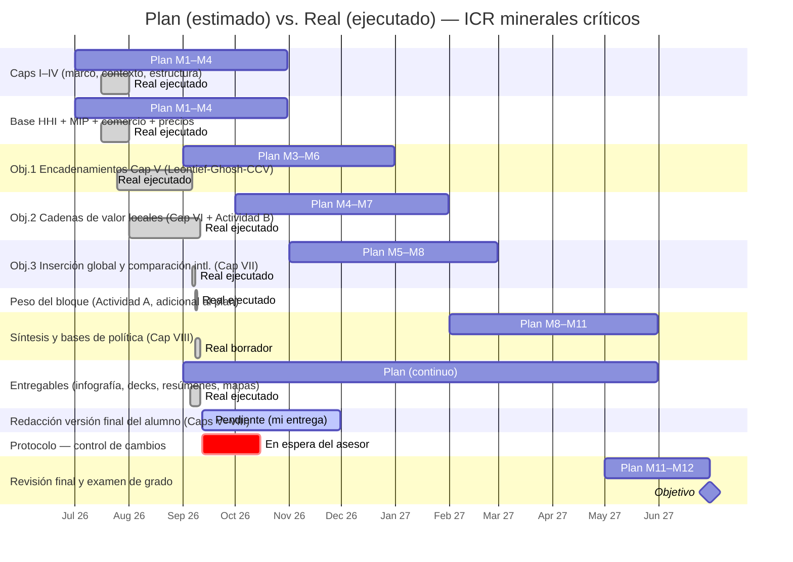

# Estructura y Cronograma de la ICR — panorama de avance

> [!abstract] Qué es este documento
> El **mapa único de avance** de la tesis: descompone cada capítulo en **temas → subtemas → actividades**, cruza cada uno con un **cronograma de 12 meses** (inicio jul 2026), y compara **lo estimado antes de iniciar** (plan del protocolo) contra **el tiempo real** que tomó. Marca con precisión qué está terminado, qué está en proceso, qué solo espera mi versión de entrega y qué no se ha iniciado. Está pensado para (a) evaluar mi ritmo, (b) ver de un vistazo lo hecho / lo que falta, y (c) que cualquier persona entienda el avance **sin perder de vista dónde vive cada dato, cálculo y redacción** (todo enlazado).

> [!tip] Versión interactiva (recomendada para explorar)
> Tablero **desplegable** (capítulos → subtemas → actividades) con filtros por estado y línea de tiempo plan vs. real sin encimes: **https://claude.ai/code/artifact/d020c84f-0043-4943-a46a-a57c6a10dca9** (privado; requiere tu sesión de Claude). Esta nota es el respaldo enlazado dentro del vault (para no perder ningún dato/cálculo/redacción); el artefacto es la vista para ver el avance de un vistazo.

## 1. Panorama (dashboard)

> [!success] Estado global (2026-09-11)
> - **Datos e indicadores:** ✅ **completos y validados** (8 indicadores + Actividad A histórica + Actividad B de cadenas de valor). Es el aporte central y está terminado.
> - **Redacción — Caps. I–IV (voz del alumno):** ✅ **aceptados** (borrador completo, 82 pp.).
> - **Redacción — Caps. V–VIII (borrador con resultados):** 📝 **falta versión de entrega** — el contenido, método y resultados están escritos en `.docx`; el paso pendiente es que **yo (Jorge) los adapte a mi redacción**.
> - **Protocolo:** ⏸️ control de cambios **en espera del asesor**.
> - **Ritmo:** el bloque de datos y análisis se ejecutó en **~2 meses (jul–sep 2026)**, frente a los **~11 meses** que preveía el plan → **muy adelantado** en análisis; la ruta crítica restante es **redacción final + revisión + examen**.

| Bloque | Terminado ✅ | Falta mi entrega 📝 | En proceso 🔵 | En espera ⏸️ | No iniciado / opcional |
|---|---|---|---|---|---|
| Capítulos (8) | I, II, III, IV | V, VI, VII, VIII | — | — | — |
| Datos e indicadores | los 8 + A + B | — | — | — | migración total a Markdown (opc.) |
| Protocolo | — | — | — | control de cambios (asesor) | — |
| Cierre | — | — | — | — | revisión final + examen |

## 2. Cómo leer este documento (leyenda)

> [!info]- Estados de avance (clic)
> - ✅ **Terminado** — dato/cálculo/redacción hecho **y aceptado por el alumno** (versión final).
> - 📝 **Falta versión de entrega** — *yo (Claude) ya hice mi parte* (dato, resultado o borrador redactado); **falta que Jorge lo adapte a su propia redacción/voz**. Nada por calcular, solo integrar.
> - 🔵 **En proceso** — trabajo iniciado, no cerrado.
> - ⏸️ **En espera de un tercero** — depende del asesor (p. ej. aceptar control de cambios).
> - ⏳ **No iniciado**.
> - ⭕ **Opcional** — dentro del alcance solo si se decide (no bloquea la entrega).
> - **📝 (borrador inicial listo)** — variante de "falta mi versión de entrega" donde el dato estaba validado **y ya escribí la versión inicial del texto** ([[Borradores iniciales - secciones con dato listo (para version de entrega)]]); falta que yo la revise, adapte a mi estilo y complemente. Antes se rotulaban "dato listo · texto pendiente".

> [!info]- Notación de tiempo: estimado vs real (clic)
> - 🟦 **Plan (estimado)** = lo previsto en el cronograma del protocolo, *antes* de iniciar (horizonte 12 meses, jul 2026 – jun 2027).
> - 🟥 **Real (ejecutado)** = cuándo ocurrió de verdad (bitácora). En el Gantt, las barras **`done`** (marcadas/oscuras) son el tiempo real; las barras claras son el plan.
> - **Inicio del proyecto:** julio 2026 (M1). **Fecha de este corte:** 11 sep 2026 (≈ M3).

## 3. Cronograma visual — plan vs. real

> [!note] Para la línea de tiempo clara y sin encimes, usa el [tablero interactivo](https://claude.ai/code/artifact/d020c84f-0043-4943-a46a-a57c6a10dca9) (pestaña "Línea de tiempo"). El diagrama de abajo es un respaldo estático dentro del vault.

*Barra clara = plan (estimado del protocolo). Barra marcada (done) = tiempo real ejecutado. Se ve la compresión: el análisis, previsto hasta 2027, se ejecutó entre julio y septiembre de 2026.*

## 4. Desglose por capítulo (tema → subtema → actividad)

*Cada capítulo es un **tema**; sus secciones son **subtemas**; la columna "actividad / contenido" resume el trabajo que lo sostiene. "Dónde vive" enlaza el dato, cálculo o redacción para no perder nada.*

### Cap. I — Introducción · ✅ (con un inserto 📝)
| Subtema | Actividad / contenido | Estado | 🟦 Plan | 🟥 Real | Dónde vive |
|---|---|---|---|---|---|
| I.1 Estructura de la tesis | Redacción | ✅ | M1 | jul 2026 | Caps I-IV (docx) |
| I.2 Preguntas, objetivos e hipótesis | Redacción | ✅ | M1 | jul 2026 | [[Pregunta de Investigacion]] · [[Objetivos]] · [[Hipotesis]] |
| I.x Justificación — peso del bloque | Inserto con datos (Actividad A) | 📝 | — | sep 2026 | [[Justificacion]] · `11 Redaccion/Justificacion - peso del bloque (inserto Cap I) 2026-09-09.docx` |

### Cap. II — Marco conceptual y teórico · ✅
| Subtema | Actividad / contenido | Estado | 🟦 Plan | 🟥 Real | Dónde vive |
|---|---|---|---|---|---|
| II.1 Definición de mineral crítico | Revisión de literatura | ✅ | M1–M2 | jul 2026 | Caps I-IV (docx) |
| II.2 Justificación del corpus de 10 | Criterios de selección | ✅ | M1–M2 | jul 2026 | [[Capitulo 2 - Marco Teorico]] |
| II.3 Factores de demanda | Revisión | ✅ | M1–M2 | jul 2026 | Caps I-IV (docx) |
| II.4 Marco teórico (enclave estructural) | Articulación Cardoso-Faletto → Svampa; reestructurado | ✅ | M2 | jul–ago 2026 | [[Marco Teorico - Tres Tradiciones]] · [[Propuesta - Reestructuracion Cap II (marco articulado enclave)]] |

### Cap. III — Contexto histórico 1988–2025 · ✅
| Subtema | Actividad / contenido | Estado | 🟦 Plan | 🟥 Real | Dónde vive |
|---|---|---|---|---|---|
| III.1–III.2 Modelo previo y reforma estructural | Redacción | ✅ | M1–M3 | jul 2026 | Caps I-IV (docx) |
| III.4 Ciclo de superprecios | Redacción | ✅ | M1–M3 | jul 2026 | Caps I-IV (docx) |
| III.5 Consolidaciones corporativas | Redacción | ✅ | M1–M3 | jul 2026 | Caps I-IV (docx) |
| III.6 Reforma a la Ley Minera 2023 | Redacción | ✅ | M1–M3 | jul 2026 | Caps I-IV (docx) |

### Cap. IV — Estructura empresarial (10 minerales) · ✅
| Subtema | Actividad / contenido | Estado | 🟦 Plan | 🟥 Real | Dónde vive |
|---|---|---|---|---|---|
| IV.1 Lógica de la coextracción | Redacción | ✅ | M1–M4 | jul–ago 2026 | Caps I-IV (docx) |
| IV.2–IV.11 Perfil por mineral (10) | Estructura, HHI, propiedad, destino, reforma | ✅ | M1–M4 | jul–ago 2026 | [[Barita]] · [[Cobre]] · [[Fluorita]] · [[Grafito]] · [[Manganeso]] · [[Oro]] · [[Plata]] · [[Plomo]] · [[Silice]] · [[Zinc]] |
| IV.12 Síntesis comparativa | Redacción | ✅ | M4 | ago 2026 | [[Sintesis Comparativa]] |

### Cap. V — Encadenamientos productivos (Leontief/Ghosh/CCV) · 📝 falta versión de entrega
| Subtema | Actividad / contenido | Estado | 🟦 Plan | 🟥 Real | Dónde vive |
|---|---|---|---|---|---|
| V.1–V.5 Método (MIP, Leontief, Ghosh, Rasmussen) | Redacción metodológica + notación L0–L4 | 📝 | M3–M6 | jul–sep 2026 | Cap V (docx) · [[Calcular Leontief y Ghosh]] |
| V.6 Fuente y operacionalización | MIP INEGI 2013/2018; validado vs INEGI | 📝 (borrador inicial listo) | M3 | ago 2026 | `mip_calc.py` · [[Memoria - Encadenamientos MIP (Leontief Ghosh Hirschman-Rasmussen)]] |
| V.7 Resultados por mineral | Cálculo encadenamientos | 📝 (borrador inicial listo) | M4–M6 | ago 2026 | `processed/mip_encadenamientos_minerales.csv` |
| V.8 Demanda intermedia doméstica | Cálculo compradores por mineral | 📝 (borrador inicial listo) | M4–M6 | ago 2026 | `processed/mip_demanda_intermedia_minerales.csv` |
| V.10 Cautela del Ghosh | 5 razones (Ghosh>1 ≠ cadena) | 📝 | M6 | sep 2026 | Memoria encadenamientos §4bis |
| V.11 CCV (captura de valor) | Serie 1992–2025 | 📝 (borrador inicial listo) | M4–M6 | sep 2026 | [[Memoria - CCV (coeficiente de captura de valor, serie 1992-2025)]] · `ccv_serie.csv` |
| V.12 Corte de referencia 2008 | MIP 2008 (no comparable en nivel) | 📝 (borrador inicial listo) | — | sep 2026 | `mip_encadenamientos_2008_referencia.csv` |
| V.13 Límites metodológicos | Redacción | 📝 | M6 | sep 2026 | Cap V (docx) |

### Cap. VI — Caracterización de los mercados (tipología descriptiva) · 📝 falta versión de entrega
| Subtema | Actividad / contenido | Estado | 🟦 Plan | 🟥 Real | Dónde vive |
|---|---|---|---|---|---|
| VI.2 Fases de la cadena + notación L0–L4 | Marco de eslabones | 📝 | M4 | sep 2026 | Cap VI (docx) §VI.2/§VI.2.1 |
| VI.3 Perfil por mineral (10) | Productos por fase + HHI + Ghosh + posición + cadena local | 📝 (borrador inicial listo) | M4–M7 | ago–sep 2026 | Cap VI (docx) |
| VI.4 Evolución del HHI 2004–2024 | Cálculo serie | ✅ | M4 | sep 2026 | `hhi_consolidado.csv` · [[Serie historica HHI]] |
| VI.5 Georreferenciación | Extracción×estado + co-localización | ✅ | M5 | sep 2026 | [[Memoria - Georreferenciacion y destinos (extraccion, transformacion, exportacion)]] · `georref_*.csv` |
| VI.6 Destinos de exportación | Serie 1992–2024; desplazamiento a China | ✅ | M5 | sep 2026 | `comercio_destinos_serie_resumen.csv` |
| VI.7 Tipología A/B/C/D | Clasificación de los 10 | 📝 (borrador inicial listo) | M7 | sep 2026 | `cv_tipologia.csv` |
| VI.8 Cadenas de valor locales (Actividad B) | 10 fichas L0–L4 + cuantificación + ruptura + mapas + socios | ✅ | M7 | sep 2026 | **[[Indice - Fichas de Cadena de Valor]]** · `cv_*.csv` · `13 Entregables/mapas/` |
| VI.9 Bases de política | Redacción | 📝 | M7 | sep 2026 | Cap VI (docx) |

### Cap. VII — Reforma 2023 (contexto) + referencia internacional · 📝 falta versión de entrega
| Subtema | Actividad / contenido | Estado | 🟦 Plan | 🟥 Real | Dónde vive |
|---|---|---|---|---|---|
| VII.1 Contenido y coyuntura de la reforma | Redacción | 📝 | M5–M7 | sep 2026 | Cap VII (docx) · [[Capitulo 7 - Impacto Reforma 2023]] |
| VII.2 Estrategia empírica (escritorio) | Redacción | 📝 | M5 | sep 2026 | Cap VII (docx) |
| VII.2.2 Event study (MacKinlay) | Complemento cuantitativo | ⭕ | M5–M7 | — | [[Ventana Event Study]] · [[Calcular CAR]] (opc.) |
| VII.2.3 Entrevistas semiestructuradas | Complemento cualitativo | ⭕ | M5–M7 | — | [[Guia de entrevistas]] · [[Realizar entrevistas]] (opc.) |
| VII.5 Referencia internacional (8 países) | Ghosh + DVA (OECD ICIO) | 📝 (borrador inicial listo) | M8 | sep 2026 | [[Memoria - Comparacion internacional (Chile, Australia) encadenamientos]] · `icio_*.csv` |
| VII.5.1 El enclave en dinero (DVA) | Descomposición valor agregado 1995–2020 | ✅ | M8 | sep 2026 | `icio_dva_mineria.csv` |

### Cap. VIII — Síntesis, conclusiones y recomendaciones · 📝 falta versión de entrega
| Subtema | Actividad / contenido | Estado | 🟦 Plan | 🟥 Real | Dónde vive |
|---|---|---|---|---|---|
| VIII.1 Síntesis de hallazgos | Integración de 5 indicadores | 📝 | M8–M11 | sep 2026 | Cap VIII (docx) |
| VIII.2 Tipología + posición en la cadena (L0–L4) | Patrón agregado + mapa de conjunto | 📝 | M8–M11 | sep 2026 | Cap VIII (docx) · [[Sintesis - Patron agregado y bases de politica (cadenas de valor)]] |
| VIII.3 Recomendaciones de política | Bases por tipo A/B/C/D + contrafactual | 📝 | M9–M11 | sep 2026 | Cap VIII (docx) |
| VIII.4 Limitaciones y declaración de vacíos | Redacción | 📝 | M11 | sep 2026 | Cap VIII (docx) |

## 5. Componente transversal — datos e indicadores (aporte central) · ✅

*Estos indicadores sostienen varios capítulos a la vez; todos están construidos y validados ([[Auditoria - verificacion matematica de indicadores 2026-09-08|auditoría matemática]]).*

| # | Indicador / actividad | Estado | Real | Dónde vive |
|---|---|---|---|---|
| 1 | HHI (concentración) 1994–2024 | ✅ | jul–sep 2026 | `hhi_consolidado.csv` |
| 2 | Encadenamientos MIP (Leontief/Ghosh/Rasmussen) 2013/2018 (+2008 ref.) | ✅ | ago–sep 2026 | `mip_encadenamientos_minerales.csv` |
| 3 | Demanda intermedia doméstica por mineral | ✅ | ago 2026 | `mip_demanda_intermedia_minerales.csv` |
| 4 | CCV (captura de valor) serie 1992–2025 | ✅ | sep 2026 | `ccv_serie.csv` |
| 5 | Comercio por etapa 1992–2024 + destinos | ✅ | sep 2026 | `comercio_por_etapa_1992_2024.csv` |
| 6 | Empresas de transformación (cadena local) | ✅ | ago 2026 | `empresas_transformacion.csv` |
| 7 | Georreferenciación + regionalización | ✅ | sep 2026 | `georref_regionalizacion.csv` |
| 8 | Comparación internacional (8 países) Ghosh + DVA | ✅ | sep 2026 | `icio_comparacion_mineria.csv` · `icio_dva_mineria.csv` |
| 8b | Ghosh estatal e inter-estatal (MIP multi-estatal 2018) | ✅ | sep 2026 | `ghosh_estatal_mineria.csv` · `ghosh_interestatal_mineria.csv` |
| A | Peso del bloque (PIB, exportaciones, empleo) 1992–2024 | ✅ | sep 2026 | [[Memoria - Peso del bloque de 10 minerales (PIB, exportaciones, empleo)]] |
| B | Cadenas de valor locales (10 fichas L0–L4 + mapas + socios) | ✅ | sep 2026 | [[Indice - Fichas de Cadena de Valor]] |

## 6. Ruta crítica y siguientes pasos

> [!todo] Lo que falta para cerrar (en orden)
> 1. **📝 Versión de entrega de Caps. V–VIII** — adaptar a mi redacción/voz los borradores con resultados (yo, Jorge). *Es la ruta crítica.* Prioridad: V → VI → VIII → VII.
> 2. **📝 Integrar el inserto de justificación** (peso del bloque) al Cap. I.
> 3. **⏸️ Protocolo** — esperar al asesor para aceptar el control de cambios (no tocar antes).
> 4. **⭕ Opcionales** (no bloquean): event study y entrevistas del Cap. VII; migración de la redacción íntegra a Markdown; bilateral de comercio por socio.
> 5. **⏳ Revisión final + examen de grado** (plan M11–M12, may–jun 2027).

> [!tip] Lectura del ritmo
> El diseño de indicadores y el análisis —el corazón metodológico y el aporte original— están **terminados y validados**, ~9 meses antes de lo previsto. El proyecto pasó de "construir datos" a "redactar la versión final": el cuello de botella ya **no es técnico sino de escritura e integración**.

## 7. Enlaces

**Planeación y seguimiento:** [[Home]] · [[Cronograma]] (plan original) · [[Tablero de Actividades]] · [[Bitacora]] · [[Estructura de la Tesis]] · [[Ruta - Completar indicadores y series (seguimiento)]]

**Índices para no perder nada** (todo dato, cálculo y redacción está catalogado aquí): [[Catalogo de Bases de Datos]] (datos e indicadores) · [[Indice de Redaccion Word]] (capítulos) · [[Indice Diagnostico Insumo-Producto]] (memorias) · [[Indice - Fichas de Cadena de Valor]] (cadenas de valor)

**Síntesis y auditoría:** [[Resumen descriptivo de la investigacion (datos e indicadores)]] · [[Auditoria - verificacion matematica de indicadores 2026-09-08]] · [[Auditoria - Que sigue sirviendo]]
