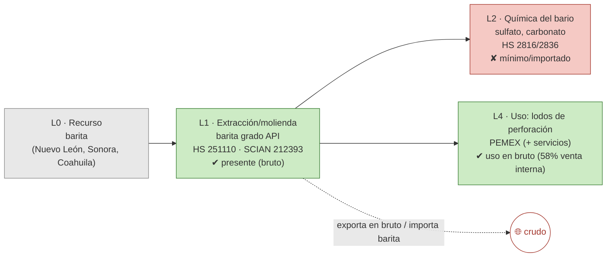

# Ficha de cadena de valor — Barita

> [!abstract] Síntesis
> **Tipo D — se detiene en el mineral en bruto.** La barita se extrae y se muele (L1) y se usa **como mineral molido** (densificante de los lodos de perforación petrolera de PEMEX); no hay una **química del bario (L2)** relevante en el país (los compuestos se importan o son mínimos). Es un mercado pequeño y ligado al ciclo petrolero: cuando exporta, exporta **en bruto** (crudo = 100 %); y también **importa** barita para abastecer la perforación. Punto de ruptura: **L1→L2** — la cadena prácticamente no arranca aguas abajo.

> [!info]- ¿Cómo leer esta ficha? (clic para desplegar)
> Cinco **eslabones**: **L0** recurso · **L1** extracción/molienda · **L2** química del bario (sulfato, carbonato) · **L4** uso (perforación petrolera). Marcas **✔/◑/✘**. El **tipo D** es el enclave más simple: el mineral **sale (o se usa) en bruto** y no se le agrega transformación química dentro del país.

## 1. Árbol de la cadena (L0→L4)

*Verde = existe; rojo = ausente/importado; azul = uso doméstico; flechas rojas = fugas.*

**Lectura del diagrama.** La barita casi no tiene cadena: se saca, se muele y se usa (o se exporta) **en bruto**. Su destino doméstico es la **perforación petrolera** (como peso para los lodos), pero eso no le agrega transformación química. La química del bario es marginal.

## 2. Cuantificación por eslabón

> [!note]- ¿Qué significan estas columnas? (clic)
> **VBP/empleo** de la MIP (mmp, base 2018); **X/M** = export/import (MUSD, prom. 2018–2023). Cifras pequeñas: es el mercado más chico del bloque.

| Eslabón | Existe | VBP 2018 (mmp) | Empleo 2018 | X (MUSD) | M (MUSD) | Lectura en una línea |
|---|---|---:|---:|---:|---:|---|
| **L1** extracción/molienda | ✔ | 0.7 | 1 713 | 12 | 5 | mineral molido (bruto) |
| **L2** química del bario | ✘ | n/a | n/a | 0 | 4 | mínima/importada |
| **L4** uso (perforación) | ✔ | — | — | — | — | densificante de lodos (PEMEX) |

Fuente: [[cv_eslabones_cuantificado]].

**Captura de valor (CCV):** 0.82–0.93. Alta en apariencia, pero es sobre un producto de **muy bajo valor unitario** (mineral molido): capta casi todo el valor… de algo que vale poco. ([[Memoria - CCV (coeficiente de captura de valor, serie 1992-2025)|CCV]])

## 3. Actores por eslabón

| Eslabón | Actor | Rol | Ubicación | Propiedad |
|---|---|---|---|---|
| L4 (uso) | **PEMEX** (+ servicios: Halliburton, Baker Hughes, SLB) | Barita grado API como densificante de lodos | Cuenca de Campeche / Golfo | estatal + extranjera (servicios) |
| L1 | Baramin y productores de Coahuila/Sonora | Extracción y molienda | Norte | nacional |

**Lectura.** El único "eslabón" aguas abajo es el **uso** en perforación (PEMEX y las compañías de servicios). No hay transformación química nacional. Fuente: [[empresas_transformacion]] · [[Barita]] (Cap. IV).

## 4. Encadenamientos y demanda intermedia (MIP)

- **A quién le vende dentro del país (2018):** **58 %** a *Perforación de pozos petroleros y de gas* (213111) y **14 %** a *Extracción de petróleo* → la barita es, esencialmente, un **insumo petrolero**.
- **Arrastre (Rasmussen 2018):** hacia atrás 0.96, hacia adelante **0.64** (rank 614/834), de los **más bajos** del bloque: casi no arrastra aguas adelante. Fuente: [[mip_encadenamientos_minerales]].

## 5. Cierre aguas abajo

- **Espejo:** cuando exporta, exporta **crudo (100 %)**; y depende del ciclo petrolero (importa barita para abastecer la perforación en años de alta actividad). ([[comercio_posicion_resumen]])
- **Eslabón faltante:** toda la química del bario (L2), hoy inexistente/importada.

## 6. Georreferenciación

- **HHI geográfico:** 4 907; líder Nuevo León 59 %.
- **Co-localización: no** — extracción en el norte; uso en las cuencas petroleras del Golfo (Campeche). ([[georref_regionalizacion]])

## 6b. Mapa de la cadena y socios comerciales

*Izquierda: extracción por estado y uso (perforación petrolera). Derecha: a qué países se exporta (rojo) y de cuáles se importa (azul). Comtrade 2019-2024.*

![[mapa_barita.png]]

**Ubicación de los eslabones (empresa · sitio):** extracción y molienda en el **norte (Nuevo León, Coahuila, Sonora)**; uso en la perforación de la **Cuenca de Campeche/Golfo** (PEMEX + servicios). Detalle en §3.

**Socios comerciales (2019-2024):**

| Flujo | Principales socios |
|---|---|
| Exporta a | **Estados Unidos 100 %** |
| Importa de | Estados Unidos 39 % · China 28 % · España 2 % |

**Lectura.** El comercio de barita es un **eje bilateral con Estados Unidos** (mercado petrolero integrado): se exporta en bruto y se importa barita/insumos según el ciclo de perforación. Sin química del bario, no hay eslabón de valor que capturar.

## 7. Clasificación tipológica

> [!note] Tipo **D — se detiene en el mineral en bruto**
> | Criterio | Evidencia | → |
> |---|---|---|
> | (i) Actores | sólo extracción/molienda + uso petrolero; sin química | cadena no arranca |
> | (ii) Espejo | exporta en bruto (crudo 100 %) | ruptura L1→L2 |
> | (iii) Ghosh/DI | forward 0.64 (muy bajo); insumo petrolero | mínimo arrastre |
>
> **Asignación: D.** El caso más puro de "extraer y usar en bruto": no hay transformación química del bario en el país. (Tipos: **A** desarrollada · **B** truncada · **C** usuario con insumo importado · **D** exportación en bruto.)

## Fuentes / archivos
`processed/cv_arbol_mineral.csv` · `processed/cv_eslabones_cuantificado.csv` · [[peso_bloque_mineria]] · [[mip_encadenamientos_minerales]] · [[comercio_posicion_resumen]] · [[georref_regionalizacion]] · [[empresas_transformacion]]

← [[Indice - Fichas de Cadena de Valor]] · [[Ruta metodologica - Construccion de cadenas de valor locales por mineral]] · [[Barita]]
