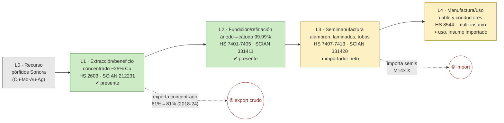

# Ficha de cadena de valor — Cobre

> [!abstract] Síntesis
> **Tipo B — cadena truncada en el metal.** El cobre tiene los eslabones L1 (extracción), L2 (fundición-refinación) y L3 (laminación) **presentes** dentro del país, pero **el grueso del mineral sale en bruto**: la exportación como concentrado (E1) subió de **61 % (2018) a 81 % (2024)** del valor exportado, mientras las semimanufacturas (E3) y manufacturas (E4) son **importadoras netas**. La captura de valor (CCV) es de **0.23–0.26** (2024–2025): México retiene ~un cuarto del precio del metal refinado al exportar concentrado. Punto de ruptura: **L2→L3**.

> [!info]- ¿Cómo leer esta ficha? (clic para desplegar)
> Una **cadena de valor** es el recorrido de un mineral desde que se saca de la tierra hasta que se vuelve un producto terminado. La dividimos en cinco **eslabones**:
> - **L0 · Recurso** — el yacimiento en el suelo (dotación geológica).
> - **L1 · Extracción y beneficio** — la mina saca la roca y la muele hasta un **concentrado** (polvo mineral enriquecido). Es la etapa comercial **E1**.
> - **L2 · Fundición / refinación** — el concentrado se funde y purifica hasta **metal** (o un químico primario). Etapa **E2**.
> - **L3 · Semimanufactura** — el metal se transforma en insumos industriales (alambrón, láminas, tubos). Etapa **E3**.
> - **L4 · Manufactura final / uso** — el producto que llega al usuario (cable, motor…). Etapa **E4**.
>
> Cada eslabón se marca **✔ presente** / **◑ parcial** / **✘ ausente** en México. El **punto de ruptura** es el eslabón donde la cadena deja de agregar valor dentro del país: de ahí en adelante el mineral se exporta en bruto o el producto terminado se importa. Ese punto define el **tipo (A/B/C/D)** y es la huella del **enclave estructural** (extraer mucho pero transformar poco con capital nacional).

## 1. Árbol de la cadena (L0→L4)

*Verde = existe en México; amarillo = existe pero débil/importador neto; las flechas punteadas rojas son las "fugas" (mineral que sale crudo o producto que entra importado).*

**Lectura del diagrama.** México saca cobre (L1), lo funde y refina (L2) y hasta hace semis (L3), pero por dos "fugas" la cadena no se cierra: una parte creciente del mineral **se exporta como concentrado** sin refinar, y los productos semielaborados (alambre, láminas) **se compran al exterior**. El eslabón del cable (L4) usa insumo importado.

## 2. Cuantificación por eslabón

> [!note]- ¿Qué significan estas columnas? (clic)
> - **VBP** = valor de la producción del eslabón; **empleo** = puestos de trabajo. Ambos vienen de la Matriz Insumo-Producto (MIP) del INEGI, en **mmp** (miles de millones de pesos, base 2018).
> - **X / M** = exportaciones / importaciones del eslabón (millones de dólares, promedio 2018–2023).
> - "n/a" en L4 = no existe una categoría estadística que mida sólo "cobre" en ese eslabón (el cable mezcla muchos insumos), así que no se le puede poner un número de VBP sin inflarlo.

| Eslabón | Existe | VBP 2018 (mmp) | Empleo 2018 | X (MUSD) | M (MUSD) | Lectura en una línea |
|---|---|---:|---:|---:|---:|---|
| **L1** extracción | ✔ | 92.9 | 8 718 | 2 968 | 672 | mucha mina; exporta concentrado |
| **L2** fund./refinación | ✔ | 80.9 | 6 301 | 773 | 966 | sí hay fundición (Grupo México) |
| **L3** semimanufactura | ◑ | 36.0 | 7 204 | 529 | 2 100 | **importa 4× lo que exporta** |
| **L4** manufactura/uso | ◑ | n/a | n/a | 69 | 402 | usa cobre, pero con insumo importado |

Fuente: [[cv_eslabones_cuantificado]] · [[peso_bloque_mineria]].

**Captura de valor (CCV, etapa E1):** 0.222 (2022) · 0.157 (2023) · 0.230 (2024) · 0.259 (2025). En palabras: al exportar el mineral como concentrado, México cobra apenas **~23–26 % del precio** que tendría ese cobre ya convertido en cátodo refinado; el resto del valor se genera (y se queda) en la fundición y manufactura de otros países. ([[Memoria - CCV (coeficiente de captura de valor, serie 1992-2025)|CCV]])

## 3. Actores por eslabón

*¿Quién opera cada eslabón dentro del país y de quién es? (la propiedad importa: un enclave "clásico" es de capital extranjero; el "estructural" puede ser de capital nacional pero igual no encadena aguas abajo).*

| Eslabón | Actor | Rol · capacidad | Ubicación | Propiedad |
|---|---|---|---|---|
| L2 | **Grupo México** (Mexicana de Cobre) | Fundición + refinería La Caridad | Nacozari, Son. | nacional |
| L2 | Grupo México (Buenavista) | Fundición | Cananea, Son. | nacional |
| L2 | Cobre de México, S.A. | Refinería primaria | CDMX | nacional |
| L3 | **Viakable** (Grupo Xignux) | Mayor fabricante de conductores | Monterrey / SLP | nacional |
| L3 | **Condumex** (Grupo Carso) | Conductores de cobre | Vallejo, CDMX | nacional |

**Lectura.** El cobre mexicano es un **cuasi-monopolio**: Grupo México concentra ~78 % de la extracción (2024) y prácticamente toda la refinación. Sí existen fabricantes nacionales de cable (Viakable, Condumex), pero no alcanzan a absorber la producción minera. Fuente: [[empresas_transformacion]] · [[Cobre]] (Cap. IV).

## 4. Encadenamientos y demanda intermedia (MIP)

> [!note]- ¿Qué es un "encadenamiento"? (clic)
> La MIP permite ver **a qué industrias les vende** el cobre dentro del país (demanda intermedia) y qué tanto "jala" a la economía (índices de Rasmussen: *hacia adelante* = a quienes lo usan; *hacia atrás* = a sus proveedores; **>1 = jala más que el sector promedio**).

- **A quién le vende dentro del país (2018):** 93.5 % a *Fundición y refinación de cobre*; el resto es autoconsumo minero. En 2013 la venta se repartía 52 % fundición / 45 % laminación → la conexión con la **laminación se debilitó** (señal de que la cadena se acortó, no se profundizó).
- **Arrastre (Rasmussen 2018):** hacia atrás 0.94 (jala poco a proveedores), hacia adelante **1.34** (rank 185 de 834). El empuje "hacia adelante" es alto **pero se materializa como exportación de metal**, no como más eslabones locales. Fuente: [[mip_encadenamientos_minerales]] · [[mip_demanda_intermedia_minerales]].

## 5. Cierre aguas abajo (¿la cadena se cierra o se importa?)

> [!note]- Qué es el "análisis espejo" (clic)
> Comparar qué se exporta crudo contra qué se importa ya procesado. Si un país **exporta el mineral en bruto e importa el producto terminado**, es señal de que la transformación de valor ocurre afuera.

- **Espejo:** la parte exportada en crudo (`X_share_crudo`) pasó de **0.61 (2018) a 0.81 (2024)**; a la vez importa procesado (`M_share_procesado` ~0.82–0.86). Es decir: **cada vez se exporta más crudo y se importa más procesado** → la transformación de mayor valor se aleja del país. ([[comercio_posicion_resumen]])
- **Industria usuaria doméstica:** manufactura eléctrica y automotriz (cable, arneses), que hoy se surte en parte con semis importados. Ahí está el mercado que una política de encadenamiento buscaría abastecer localmente.

## 6. Georreferenciación

- **Concentración geográfica (HHI):** 5 186; el líder es **Sonora con 70 %** de la extracción. (HHI cerca de 10 000 = un solo estado; 5 186 = fuerte concentración.)
- **Co-localización L1–L2: sí** — la fundición y refinería **La Caridad está junto a la mina** en Nacozari. Es de los pocos casos del bloque donde extraer y fundir ocurren en el mismo lugar (ventaja logística desaprovechada porque igual se exporta concentrado). ([[georref_regionalizacion]])

## 6b. Mapa de la cadena y socios comerciales

*Izquierda: extracción por estado (intensidad del color) y plantas de transformación con su empresa. Derecha: a qué países se exporta (rojo) y de cuáles se importa (azul). Comtrade 2019-2024.*

![[mapa_cobre.png]]

**Ubicación de los eslabones (empresa · sitio):** fundición/refinación en **Nacozari y Cananea, Sonora** (Grupo México — La Caridad, Buenavista) y **CDMX** (Cobre de México); semis en **Monterrey/SLP** (Viakable) y **Vallejo, CDMX** (Condumex). Detalle en §3.

**Socios comerciales (2019-2024):**

| Flujo | Principales socios |
|---|---|
| Exporta a | **China 71 %** · Estados Unidos 23 % · Corea del Sur 1 % |
| Importa de | Estados Unidos 74 % · Chile 9 % · Perú 4 % |

**Lectura.** El patrón geográfico confirma el enclave: se **exporta el concentrado a China** (que hace la refinación de mayor valor) y se **importan las semimanufacturas y el metal de Estados Unidos**. La cadena física sale del país en el eslabón crudo y vuelve, procesada, desde otra economía.

## 7. Clasificación tipológica

> [!note] Tipo **B — truncada en el metal**
> | Criterio | Evidencia | → |
> |---|---|---|
> | (i) Actores por eslabón | L1, L2, L3 con actores nacionales; L4 sin producción atribuible | L1–L3 presentes |
> | (ii) Espejo / X_share_crudo | crudo 61 %→81 %; semis importador neto | ruptura L2→L3 |
> | (iii) Ghosh / demanda intermedia | forward alto pero realizado como export de metal | conexión aguas adelante **externa** |
>
> **Asignación: B.** La cadena existe hasta el metal refinado pero no profundiza: el mineral sale mayoritariamente como concentrado y las semimanufacturas se importan. No es tipo A porque la conexión aguas adelante no se traduce en cadena local de semis/manufactura. (Recordatorio de tipos: **A** desarrollada · **B** truncada en el metal · **C** usuario con insumo importado · **D** exportación en bruto.)

## Fuentes / archivos
`processed/cv_arbol_mineral.csv` · `processed/cv_eslabones_cuantificado.csv` · [[peso_bloque_mineria]] · [[mip_encadenamientos_minerales]] · [[comercio_posicion_resumen]] · [[georref_regionalizacion]] · [[empresas_transformacion]]

← [[Indice - Fichas de Cadena de Valor]] · [[Ruta metodologica - Construccion de cadenas de valor locales por mineral]] · [[Cobre]]
