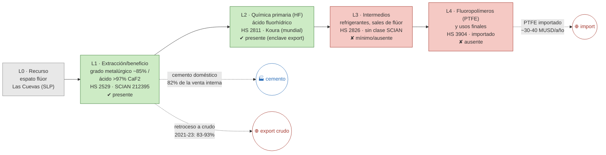

# Ficha de cadena de valor — Fluorita

> [!abstract] Síntesis
> **Tipo A (límite A/B) — la cadena no metálica más profunda del bloque.** México es 2.º productor mundial de fluorita y aloja en **Matamoros (Koura/Orbia) la mayor planta de ácido fluorhídrico (HF) del mundo**, integrada a su mina Las Cuevas (SLP): el eslabón químico L2 **existe y es de clase mundial**. Pero **L3–L4 (fluoropolímeros/PTFE) están ausentes**: se importan (~30–40 MUSD/año). Dos rasgos definen el caso: (a) el HF opera como **enclave de exportación integrado** —no aparece como cadena local en la MIP, cuyo principal comprador doméstico de fluorita es el **cemento (82 %)**—; y (b) desde 2021 hay un **retroceso hacia la exportación en bruto** (crudo 31 %→83–93 % en 2021-23, recuperado a 26 % en 2024). Punto de ruptura: **L2→L3**.

> [!info]- ¿Cómo leer esta ficha? (clic para desplegar)
> Una **cadena de valor** es el recorrido de un mineral desde que se saca de la tierra hasta que se vuelve un producto terminado. La dividimos en cinco **eslabones**:
> - **L0 · Recurso** — el yacimiento en el suelo (dotación geológica).
> - **L1 · Extracción y beneficio** — la mina saca la roca y la muele hasta un **concentrado** (aquí, "espato flúor" o fluorita concentrada). Es la etapa comercial **E1**.
> - **L2 · Fundición / química primaria** — el concentrado se transforma en un producto químico primario (aquí, **ácido fluorhídrico, HF**). Etapa **E2**.
> - **L3 · Intermedios** — a partir del HF se hacen gases refrigerantes y sales de flúor. Etapa **E3**.
> - **L4 · Producto final / uso** — fluoropolímeros como el **PTFE (teflón)** y usos finales. Etapa **E4**.
>
> Cada eslabón se marca **✔ presente** / **◑ parcial** / **✘ ausente** en México. El **punto de ruptura** es el eslabón donde la cadena deja de agregar valor dentro del país. Ese punto define el **tipo (A/B/C/D)** y es la huella del **enclave estructural** (extraer mucho pero transformar poco con capital nacional). *Nota:* en la fluorita el eslabón L2 no es una "fundición" metálica sino una **planta química** (produce ácido, no metal).

## 1. Árbol de la cadena (L0→L4)

*Verde = existe en México; rojo = ausente/importado. Flechas punteadas rojas = "fugas" (mineral que sale crudo o producto que entra importado); flecha azul = destino doméstico real (cemento).*

**Lectura del diagrama.** La fluorita mexicana llega más lejos que la mayoría: no sólo se extrae (L1), también se convierte en **ácido fluorhídrico** (L2) en la planta más grande del mundo. Pero ahí se detiene: los **fluoropolímeros (teflón) no se fabrican en México** y se importan. Además, ese HF es casi todo de **exportación** (un enclave desconectado): dentro del país, la fluorita se usa sobre todo en **cemento** (como aditivo que baja la temperatura de cocción del clínker).

## 2. Cuantificación por eslabón

> [!note]- ¿Qué significan estas columnas? (clic)
> - **VBP** = valor de la producción del eslabón; **empleo** = puestos de trabajo (MIP INEGI, **mmp** = miles de millones de pesos, base 2018).
> - **X / M** = exportaciones / importaciones (millones de dólares, promedio 2018–2023).
> - "n/a" = no existe una categoría estadística que mida **sólo** ese eslabón: el HF queda mezclado dentro de "químicos básicos inorgánicos", así que su VBP no se puede aislar sin inflarlo. Por eso ese eslabón se mide con el **comercio** y la **capacidad de la planta**, no con la MIP.

| Eslabón | Existe | VBP 2018 (mmp) | Empleo 2018 | X (MUSD) | M (MUSD) | Lectura en una línea |
|---|---|---:|---:|---:|---:|---|
| **L1** extracción | ✔ | 5.9 | 740 | 79 | 0 | exporta espato; alimenta cemento |
| **L2** HF (química) | ✔ | n/a | n/a | 87 | 41 | Koura, líder mundial; **casi todo export** |
| **L3** intermedios | ✘ | n/a | n/a | — | — | mínimo/ausente |
| **L4** fluoropolímeros/PTFE | ✘ | n/a | n/a | — | ~30–40 | **teflón importado** |

Fuente: [[cv_eslabones_cuantificado]].

**Captura de valor (CCV, etapa E1):** 0.97 (2022) · 1.08 (2023) · 1.07 (2024) · 1.13 (2025). Aquí el CCV ronda **1** porque el espato se exporta a un precio parecido a su valor de referencia: México capta casi todo el valor **del crudo**… pero el crudo vale poco frente al HF y muchísimo menos que el teflón. Un CCV≈1 no significa que la cadena esté cerrada; significa que **la vara de comparación es baja** (el propio mineral en bruto). ([[Memoria - CCV (coeficiente de captura de valor, serie 1992-2025)|CCV]])

## 3. Actores por eslabón

*¿Quién opera cada eslabón dentro del país y de quién es?*

| Eslabón | Actor | Rol · capacidad | Ubicación | Propiedad |
|---|---|---|---|---|
| L1 | Minera Las Cuevas / productores SLP | Espato flúor grado ácido | San Luis Potosí | nacional |
| L2 | **Koura (Orbia, ex-Mexichem)** | **Mayor planta de HF del mundo**, integrada con Las Cuevas | Matamoros, Tamps. | nacional |
| L4 | (no se produce en México) | PTFE/fluoropolímeros importados | — | — |
| uso | CEMEX; Holcim; Cruz Azul; GCC | Fluorita como aditivo del cemento (mineralizador) | varias | nacional/extranjera |

**Lectura.** La fluorita tiene un actor químico de talla mundial (Koura), de capital nacional, integrado a su propia mina. Es lo más cerca que está el bloque de una cadena química desarrollada; pero justo por ser un enclave de exportación, ese logro **no derrama** hacia una industria de fluoropolímeros local. Fuente: [[empresas_transformacion]] · [[georref_transformacion_nodos]] · [[Fluorita]] (Cap. IV).

## 4. Encadenamientos y demanda intermedia (MIP)

> [!note]- ¿Qué es un "encadenamiento"? (clic)
> La MIP muestra **a qué industrias les vende** la fluorita dentro del país y qué tanto "jala" a la economía (índices de Rasmussen: *hacia adelante* = a quienes la usan; *hacia atrás* = a proveedores; **>1 = jala más que el sector promedio**).

- **A quién le vende dentro del país (2018):** **82.3 % a *Fabricación de cemento*** (como aditivo), 12.6 % a otros no metálicos; sólo 3.4 % autoconsumo minero. **El HF no aparece** como comprador interno porque Koura usa su propio espato y **exporta** el ácido → el único vínculo local visible es el cemento, no la química del flúor.
- **Arrastre (Rasmussen 2018):** hacia atrás **0.97**, hacia adelante **1.31** (rank 200 de 834). En 2013 el empuje hacia adelante era menor (0.87) → **se fortaleció** con el corte 2018. Fuente: [[mip_encadenamientos_minerales]] · [[mip_demanda_intermedia_minerales]].

## 5. Cierre aguas abajo (¿la cadena se cierra o se importa?)

> [!note]- Qué es el "análisis espejo" (clic)
> Comparar qué se exporta crudo contra qué se importa ya procesado. Si un país **exporta el mineral en bruto e importa el producto terminado**, la transformación de valor ocurre afuera.

- **Espejo:** la parte exportada en crudo (`X_share_crudo`) pasó de **0.31 (2018) a 0.83–0.93 (2021-23)** y volvió a **0.26 (2024)**. En el mismo tramo, la parte exportada ya como HF cayó de 69 % a 7 % (2022) y se recuperó a 74 % (2024). Es un **retroceso real hacia el crudo** en 2021-23 (coincide con la caída documentada de exportaciones de HF). ([[comercio_posicion_resumen]])
- **Eslabón faltante:** L3–L4 (refrigerantes y fluoropolímeros), que hoy se **importan**. Ahí está el mercado que una política de encadenamiento buscaría capturar aprovechando el HF que ya se produce.

## 6. Georreferenciación

- **Concentración geográfica (HHI):** 9 158; el líder es **San Luis Potosí con 96 %** (prácticamente un solo estado extractor).
- **Co-localización L1–L2: no** — la mina está en SLP y la planta de HF en **Matamoros (Tamaulipas), en la frontera** para exportar. La propia geografía delata que el HF nació **mirando al mercado externo**, no al tejido industrial nacional. ([[georref_regionalizacion]])

## 6b. Mapa de la cadena y socios comerciales

*Izquierda: extracción por estado y plantas de transformación con su empresa. Derecha: a qué países se exporta (rojo) y de cuáles se importa (azul). Comtrade 2019-2024.*

![[mapa_fluorita.png]]

**Ubicación de los eslabones (empresa · sitio):** ácido fluorhídrico en **Matamoros, Tamaulipas** (Koura/Orbia), integrado con la mina **Las Cuevas, San Luis Potosí**. Detalle en §3.

**Socios comerciales (2019-2024):**

| Flujo | Principales socios |
|---|---|
| Exporta a | **Estados Unidos 94 %** · China 5 % · Brasil 1 % |
| Importa de | Estados Unidos 44 % · China 23 % · Alemania 9 % |

**Lectura.** El espato y el **HF se exportan casi íntegramente a Estados Unidos** (la planta está en la frontera, en Matamoros, para ello); a la vez se **importan los fluoropolímeros** (de EE.UU., China, Alemania) que México no fabrica. Es la imagen del enclave de exportación: se vende el intermedio, se compra el producto de alto valor.

## 7. Clasificación tipológica

> [!note] Tipo **A — desarrollada hasta el fluoroquímico** (límite A/B)
> | Criterio | Evidencia | → |
> |---|---|---|
> | (i) Actores por eslabón | L1 + L2 (HF de clase mundial); L3–L4 ausentes | L1–L2 presentes |
> | (ii) Espejo / X_share_crudo | históricamente procesado (HF); retroceso a crudo 2021-23 | frontera A↔B |
> | (iii) Ghosh / demanda intermedia | forward 1.31; pero venta interna = cemento, HF exporta | integración química **real pero exportadora** |
>
> **Asignación: A (caso límite con B).** Es la cadena no metálica más integrada del bloque por la presencia del HF (único eslabón químico de clase mundial entre los 10 minerales). Se marca **límite A/B** porque (a) la profundización se detiene en el HF —los fluoropolímeros se importan— y (b) el HF opera como enclave de exportación desacoplado del tejido industrial nacional (cuyo vínculo local es el cemento). El retroceso 2021-23 hacia el crudo acerca el caso a B. (Recordatorio de tipos: **A** desarrollada · **B** truncada en el metal · **C** usuario con insumo importado · **D** exportación en bruto.)

## Fuentes / archivos
`processed/cv_arbol_mineral.csv` · `processed/cv_eslabones_cuantificado.csv` · [[peso_bloque_mineria]] · [[mip_encadenamientos_minerales]] · [[comercio_posicion_resumen]] · [[georref_regionalizacion]] · [[empresas_transformacion]]

← [[Indice - Fichas de Cadena de Valor]] · [[Ruta metodologica - Construccion de cadenas de valor locales por mineral]] · [[Fluorita]]
