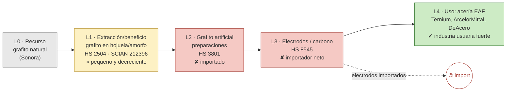

# Ficha de cadena de valor — Grafito

> [!abstract] Síntesis
> **Tipo C — usuario doméstico con eslabón importado.** México **tiene industria usuaria fuerte** (la siderurgia por horno de arco eléctrico, EAF, que usa electrodos de grafito) pero **no produce el eslabón procesado**: el grafito artificial y los **electrodos se importan** (importador neto). La extracción de grafito natural es pequeña y **decreciente**, justo cuando la criticidad del mineral crece (baterías de ion-litio). Punto de ruptura: **L1→L2/L3** (el valor procesado entra importado). Ver [[Nota - Grafito, produccion decreciente vs criticidad creciente]].

> [!info]- ¿Cómo leer esta ficha? (clic para desplegar)
> Cinco **eslabones**: **L0** recurso · **L1** extracción · **L2** procesado (grafito artificial) · **L3** electrodos/artículos de carbono · **L4** uso (siderurgia, baterías). Marcas **✔/◑/✘**. En el **tipo C** existe el **usuario** (la industria que consume el mineral) pero el **eslabón intermedio se importa**: la demanda está, la transformación no.

## 1. Árbol de la cadena (L0→L4)

*Verde = existe; rojo = ausente/importado; gris = usuario; flechas rojas = fugas.*

**Lectura del diagrama.** El caso se lee "al revés" del cobre: aquí lo que sobra es **demanda** (la siderurgia mexicana produce 96.7 % de su acero por horno de arco eléctrico, que consume electrodos de grafito), pero el **eslabón que fabrica esos electrodos no existe en el país** y se importa. La mina de grafito natural, además, se apaga.

## 2. Cuantificación por eslabón

> [!note]- ¿Qué significan estas columnas? (clic)
> **VBP/empleo** de la MIP (mmp, base 2018); **X/M** = export/import (MUSD, prom. 2018–2023). "n/a" = no hay clase estadística que aísle el eslabón (se mide con comercio).

| Eslabón | Existe | VBP 2018 (mmp) | Empleo 2018 | X (MUSD) | M (MUSD) | Lectura en una línea |
|---|---|---:|---:|---:|---:|---|
| **L1** extracción | ◑ | 0.7 | 627 | 2 | 4 | pequeño, decreciente |
| **L2** grafito artificial | ✘ | n/a | n/a | 53 | 54 | importado (balance ~0) |
| **L3** electrodos | ✘ | n/a | n/a | 121 | 178 | **importador neto** |
| **L4** uso (acería EAF) | ✔ | — | — | — | — | industria usuaria fuerte |

Fuente: [[cv_eslabones_cuantificado]].

**Captura de valor (CCV):** 0.34–0.41. La poca exportación es de grafito natural con captura media; pero el problema del grafito **no es la captura de exportación**, es la **ausencia del eslabón procesado** frente a una demanda doméstica grande. ([[Memoria - CCV (coeficiente de captura de valor, serie 1992-2025)|CCV]])

## 3. Actores por eslabón

| Eslabón | Actor | Rol | Ubicación | Propiedad |
|---|---|---|---|---|
| L4 (uso) | **Ternium; ArcelorMittal; DeAcero; Gerdau Corsa** | Acero por horno de arco eléctrico (electrodos, refractarios, recarburación) | varias | nacional/extranjera |
| L2–L3 | (mayormente importado) | Electrodos de grafito importados | — | — |

**Lectura.** Los actores presentes son **usuarios** (acereras), no productores del insumo de grafito. La brecha es el eslabón intermedio. Fuente: [[empresas_transformacion]] · [[Grafito]] (Cap. IV).

## 4. Encadenamientos y demanda intermedia (MIP)

- **A quién le vende dentro del país (2018):** 43 % a *Desbastes primarios y ferroaleaciones* y 32 % a *Complejos siderúrgicos* + 14 % a moldeo de piezas → casi todo a la **siderurgia**.
- **Arrastre (Rasmussen 2018):** hacia atrás 0.87, hacia adelante **1.71** (rank 43/834) — **forward muy alto**: el grafito es un insumo crítico para el acero, aunque el eslabón que lo procesa esté fuera. Fuente: [[mip_encadenamientos_minerales]].

## 5. Cierre aguas abajo

- **Espejo:** importador neto de grafito procesado y electrodos (`M_share_procesado` ≈ 0.97). La transformación ocurre afuera pese a haber demanda local. ([[comercio_posicion_resumen]])
- **Industria usuaria:** siderurgia EAF (grande) y, prospectivamente, baterías de ion-litio (ánodos de grafito) → mercado del eslabón faltante.

## 6. Georreferenciación

- **HHI geográfico:** 10 000 — extracción **100 % en Sonora**.
- **Co-localización: no** — no hay eslabón L2 nacional; los usuarios (acerías) están en Michoacán, Nuevo León, etc. ([[georref_regionalizacion]])

## 6b. Mapa de la cadena y socios comerciales

*Izquierda: extracción por estado y usuarios (acería EAF). Derecha: a qué países se exporta (rojo) y de cuáles se importa (azul). Comtrade 2019-2024.*

![[mapa_grafito.png]]

**Ubicación de los eslabones (empresa · sitio):** extracción de grafito natural en **Sonora**; usuarios (acero por horno de arco eléctrico) en Michoacán, Nuevo León y otros (Ternium, ArcelorMittal, DeAcero). Detalle en §3.

**Socios comerciales (2019-2024):**

| Flujo | Principales socios |
|---|---|
| Exporta a | Estados Unidos 82 % · España 5 % · Colombia 2 % |
| Importa de | **China 24 %** · Estados Unidos 20 % · Malasia 14 % |

**Lectura.** Lo poco que exporta (grafito natural) va a Estados Unidos, pero lo definitorio es la **importación del eslabón procesado —grafito artificial y electrodos— desde China y Asia**: la demanda siderúrgica existe, pero el insumo de valor se compra afuera.

## 7. Clasificación tipológica

> [!note] Tipo **C — usuario doméstico con eslabón importado**
> | Criterio | Evidencia | → |
> |---|---|---|
> | (i) Actores | usuarios (acerías) presentes; sin productor del insumo | eslabón intermedio ausente |
> | (ii) Espejo | importador neto de procesado/electrodos | ruptura L1→L2/L3 |
> | (iii) Ghosh/DI | forward 1.71 (alto), todo a siderurgia | demanda sin oferta local |
>
> **Asignación: C.** Hay industria usuaria robusta, pero el grafito procesado y los electrodos se importan; la mina, además, decrece. (Tipos: **A** desarrollada · **B** truncada · **C** usuario con insumo importado · **D** exportación en bruto.)

## Fuentes / archivos
`processed/cv_arbol_mineral.csv` · `processed/cv_eslabones_cuantificado.csv` · [[peso_bloque_mineria]] · [[mip_encadenamientos_minerales]] · [[comercio_posicion_resumen]] · [[georref_regionalizacion]] · [[empresas_transformacion]] · [[Nota - Grafito, produccion decreciente vs criticidad creciente]]

← [[Indice - Fichas de Cadena de Valor]] · [[Ruta metodologica - Construccion de cadenas de valor locales por mineral]] · [[Grafito]]
