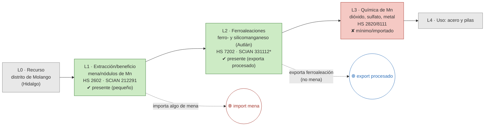

# Ficha de cadena de valor — Manganeso

> [!abstract] Síntesis
> **Tipo A — desarrollada hasta la ferroaleación.** Es, junto con la fluorita, el caso más integrado del bloque. **Compañía Minera Autlán** transforma el mineral en **ferro- y silicomanganeso** dentro del país y **exporta producto procesado, no mena** (la exportación de mena es ~0). El eslabón L2 (ferroaleaciones) existe y es de escala relevante. La cadena se detiene en L3 (química del manganeso: dióxido, sulfato), que es mínima/importada. Extracción cuasi-monoestatal (Molango, Hidalgo, ~100 %). Punto de ruptura: **L2→L3**.

> [!info]- ¿Cómo leer esta ficha? (clic para desplegar)
> Cinco **eslabones**: **L0** recurso · **L1** extracción (mina→mena, **E1**) · **L2** transformación primaria (aquí, **ferroaleación**, **E2**) · **L3** intermedios químicos (**E3**) · **L4** uso final. Marcas **✔/◑/✘**. El **punto de ruptura** define el **tipo A/B/C/D** (huella del **enclave estructural**). *En el manganeso el eslabón L2 no es fundición de metal puro sino una **aleación** (ferro-/silicomanganeso) que alimenta la siderurgia.*

## 1. Árbol de la cadena (L0→L4)

*Verde = existe; rojo = ausente/importado; flechas rojas = fugas.*

*(\*331112 "Desbastes primarios y ferroaleaciones" es clase compartida con la siderurgia y el ferrosilicio.)*

**Lectura del diagrama.** Es la excepción "virtuosa" entre los metales: en lugar de exportar mena, **Autlán la convierte en ferroaleación** dentro del país y exporta ese producto. La cadena llega hasta la aleación (insumo de la siderurgia); lo que falta es la **química fina del manganeso** (dióxido para pilas, sulfato), que se importa. Autlán incluso **importa algo de mena** para alimentar sus hornos.

## 2. Cuantificación por eslabón

> [!note]- ¿Qué significan estas columnas? (clic)
> **VBP/empleo** de la MIP (mmp, base 2018); **X/M** = export/import (MUSD, prom. 2018–2023). El "*" en L2 marca clase compartida (ferroaleaciones + acero + ferrosilicio): su VBP (≈47 mmp) **no es sólo manganeso**.

| Eslabón | Existe | VBP 2018 (mmp) | Empleo 2018 | X (MUSD) | M (MUSD) | Lectura en una línea |
|---|---|---:|---:|---:|---:|---|
| **L1** extracción | ✔ | 0.6 | 523 | 0 | 15 | mena pequeña; no se exporta |
| **L2** ferroaleaciones\* | ✔ | 47.0\* | 1 884\* | 24 | 2 | **Autlán exporta procesado** |
| **L3** química de Mn | ✘ | n/a | n/a | 0.2 | 35 | mínimo/importado |

\* Cifra combinada con siderurgia/ferrosilicio (SCIAN 331112). Fuente: [[cv_eslabones_cuantificado]] · [[peso_bloque_mineria]].

**Captura de valor (CCV):** 0.11–0.13. *Poco informativo aquí:* el CCV mide la captura al exportar **mena** (E1), pero el manganeso **no exporta mena** —exporta ferroaleación—, así que el indicador subestima el valor que sí se agrega en L2. ([[Memoria - CCV (coeficiente de captura de valor, serie 1992-2025)|CCV]])

## 3. Actores por eslabón

| Eslabón | Actor | Rol · capacidad | Ubicación | Propiedad |
|---|---|---|---|---|
| L1 | Compañía Minera Autlán | Extracción (Molango) | Hidalgo | nacional |
| L2 | **Compañía Minera Autlán** | Ferro- y silicomanganeso (~225 mil t/año); plantas Tamós, Teziutlán, Gómez Palacio | Veracruz / Puebla / Durango | nacional |

**Lectura.** Un solo grupo nacional (**Autlán**) integra extracción y ferroaleación, de la mina hasta el insumo siderúrgico. Es el ejemplo de cadena metálica desarrollada con capital nacional que la tesis contrasta con los enclaves. Fuente: [[empresas_transformacion]] · [[georref_transformacion_nodos]] · [[Manganeso]] (Cap. IV).

## 4. Encadenamientos y demanda intermedia (MIP)

- **A quién le vende dentro del país:** en 2013, **89 %** a *Desbastes primarios y ferroaleaciones* (siderurgia); en 2018 la demanda intermedia registrada aparece más dispersa (farmacéutica, alimentos para animales, ladrillos, químicos), reflejo de que la **mena doméstica es pequeña** y de usos químicos variados, mientras Autlán alimenta sus hornos con mineral propio (y algo importado).
- **Arrastre (Rasmussen 2018):** hacia atrás **1.05**, hacia adelante **1.54** (rank 77/834) — **arrastre alto** aguas adelante, coherente con su papel de insumo siderúrgico. Fuente: [[mip_encadenamientos_minerales]].

## 5. Cierre aguas abajo

- **Espejo:** `X_share_crudo` = 0 en toda la serie: **no exporta mena, exporta ferroaleación**. La dependencia de importación está en la **química fina** (L3) y en parte de la mena. ([[comercio_posicion_resumen]])
- **Eslabón faltante:** L3 (dióxido/sulfato de Mn, insumo de pilas), hoy importado.

## 6. Georreferenciación

- **HHI geográfico:** 10 000 — extracción **100 % en Hidalgo** (Molango).
- **Co-localización L1–L2: no** — mina en Hidalgo, plantas de ferroaleación en Veracruz, Puebla y Durango (cerca de energía/siderurgia). ([[georref_regionalizacion]])

## 6b. Mapa de la cadena y socios comerciales

*Izquierda: extracción por estado y plantas de transformación con su empresa. Derecha: a qué países se exporta (rojo) y de cuáles se importa (azul). Comtrade 2019-2024.*

![[mapa_manganeso.png]]

**Ubicación de los eslabones (empresa · sitio):** extracción en **Molango, Hidalgo** y ferroaleaciones en **Tamós (Veracruz), Teziutlán (Puebla) y Gómez Palacio (Durango)** — todo Compañía Minera Autlán. Detalle en §3.

**Socios comerciales (2019-2024):**

| Flujo | Principales socios |
|---|---|
| Exporta a | **Estados Unidos 96 %** · Colombia 1 % · Chile 0 % |
| Importa de | Brasil 37 % · Estados Unidos 4 % |

**Lectura.** Manganeso **exporta ferroaleación (no mena) a Estados Unidos**, su mercado siderúrgico natural, e **importa mena de Brasil** para alimentar sus hornos. Es el caso más integrado: vende producto transformado y compra materia prima, lo contrario del enclave típico.

## 7. Clasificación tipológica

> [!note] Tipo **A — desarrollada hasta la ferroaleación**
> | Criterio | Evidencia | → |
> |---|---|---|
> | (i) Actores | Autlán integra L1 + L2 (ferroaleación) | cadena local presente |
> | (ii) Espejo | exporta procesado, no mena (crudo = 0) | transformación **interna** |
> | (iii) Ghosh/DI | forward 1.54 (alto); insumo siderúrgico | fuerte arrastre |
>
> **Asignación: A.** Cadena metálica desarrollada con capital nacional que exporta ferroaleación en lugar de mena; la ruptura está más arriba (química fina de Mn). (Tipos: **A** desarrollada · **B** truncada · **C** usuario con insumo importado · **D** exportación en bruto.)

## Fuentes / archivos
`processed/cv_arbol_mineral.csv` · `processed/cv_eslabones_cuantificado.csv` · [[peso_bloque_mineria]] · [[mip_encadenamientos_minerales]] · [[comercio_posicion_resumen]] · [[georref_regionalizacion]] · [[empresas_transformacion]]

← [[Indice - Fichas de Cadena de Valor]] · [[Ruta metodologica - Construccion de cadenas de valor locales por mineral]] · [[Manganeso]]
