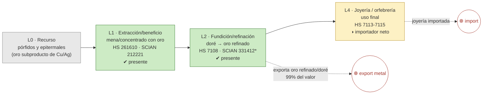

# Ficha de cadena de valor — Oro

> [!abstract] Síntesis
> **Tipo B — truncada en el metal refinado.** El oro se extrae (L1) y se refina dentro del país (L2, Met-Mex Peñoles en Torreón), y de hecho **se exporta ya como metal refinado / doré** (99 % del valor exportado es "procesado", no mena). Pero ahí termina la cadena: la **joyería y orfebrería (L4) es importadora neta**. El oro es sobre todo un **subproducto** de los pórfidos de cobre (Sonora) y de vetas epitermales, con extracción muy repartida (HHI 2 476, la menos concentrada del bloque). Punto de ruptura: **L2→L4**.

> [!info]- ¿Cómo leer esta ficha? (clic para desplegar)
> Una **cadena de valor** es el recorrido de un mineral desde el yacimiento hasta el producto terminado, en cinco **eslabones**: **L0** recurso · **L1** extracción/beneficio (mina→concentrado, etapa **E1**) · **L2** fundición/refinación (→metal, **E2**) · **L3** semimanufactura (**E3**) · **L4** manufactura final/uso (**E4**). Cada uno se marca **✔ presente / ◑ parcial / ✘ ausente** en México. El **punto de ruptura** es donde la cadena deja de agregar valor dentro del país; define el **tipo A/B/C/D** y es la huella del **enclave estructural** (extraer mucho, transformar poco con capital nacional). *En metales preciosos no hay un eslabón L3 relevante: del metal refinado se salta al uso (joyería).*

## 1. Árbol de la cadena (L0→L4)

*Verde = existe; amarillo = parcial/importador; flechas rojas punteadas = fugas.*

*(\*331412 es la clase "Fundición y refinación de metales preciosos": mezcla oro y plata, no se pueden separar.)*

**Lectura del diagrama.** A diferencia del cobre, el oro **sí se exporta ya refinado** (no como concentrado en bruto): la refinación de Peñoles agrega el valor del metal. Pero la cadena no llega al producto de consumo: la **joyería se importa**. Es una cadena que se cierra en el lingote, no en el anillo.

## 2. Cuantificación por eslabón

> [!note]- ¿Qué significan estas columnas? (clic)
> **VBP** = valor de producción; **empleo** = puestos; ambos de la MIP INEGI (**mmp** = miles de millones de pesos, base 2018). **X/M** = export/import (MUSD, prom. 2018–2023). El "*" en L2 marca que la clase estadística junta oro + plata: su VBP (≈179 mmp) es de **los dos metales combinados**, no separable.

| Eslabón | Existe | VBP 2018 (mmp) | Empleo 2018 | X (MUSD) | M (MUSD) | Lectura en una línea |
|---|---|---:|---:|---:|---:|---|
| **L1** extracción | ✔ | 69.5 | 4 931 | 128 | 0 | mucha mina (oro subproducto) |
| **L2** refinación\* | ✔ | 179.0\* | 4 622\* | 3 313 | 123 | exporta oro refinado/doré |
| **L4** joyería | ◑ | n/a | n/a | — | — | importador neto |

\* Cifra combinada oro + plata (clase SCIAN 331412). Fuente: [[cv_eslabones_cuantificado]] · [[peso_bloque_mineria]].

**Captura de valor (CCV):** *no aplica igual que en el cobre.* El indicador CCV mide cuánto del precio del metal refinado se capta al exportar el **mineral en bruto (E1)**; pero el oro casi no se exporta en bruto (se exporta ya refinado), así que su CCV≈0 no significa "poca captura" sino que **la vía de exportación es otra** (metal, no mena). ([[Memoria - CCV (coeficiente de captura de valor, serie 1992-2025)|CCV]])

## 3. Actores por eslabón

| Eslabón | Actor | Rol | Ubicación | Propiedad |
|---|---|---|---|---|
| L1 | Grupo México, Newmont, Agnico, Fresnillo, etc. | Extracción (oro primario y subproducto) | Sonora, Zacatecas, Chihuahua… | mixta |
| L2 | **Met-Mex Peñoles** | Refinería de oro y plata | Torreón, Coah. | nacional |

**Lectura.** La refinación de metales preciosos está muy concentrada en **Peñoles (Torreón)**, capital nacional. La extracción, en cambio, está repartida entre muchas empresas (incluidas extranjeras) porque el oro sale como subproducto de varias minas. Fuente: [[empresas_transformacion]] · [[Oro]] (Cap. IV).

## 4. Encadenamientos y demanda intermedia (MIP)

- **A quién le vende dentro del país (2018):** **99.5 %** a *Fundición y refinación de metales preciosos* (331412); prácticamente todo el oro minero va a la refinería y de ahí a exportación.
- **Arrastre (Rasmussen 2018):** hacia atrás 1.03, hacia adelante 1.22 (rank 271/834). Arrastre moderado; la conexión aguas adelante se agota en la refinación. Fuente: [[mip_encadenamientos_minerales]] · [[mip_demanda_intermedia_minerales]].

## 5. Cierre aguas abajo (¿la cadena se cierra o se importa?)

- **Espejo:** casi todo lo exportado es "procesado" (`X_share_procesado` ≈ 0.99); la parte cruda es marginal. Es decir, **el oro se va como metal, no como mena** — pero tampoco como joyería. ([[comercio_posicion_resumen]])
- **Eslabón faltante:** L4 (joyería/orfebrería), que es importador neto. Ahí estaría el margen para prolongar la cadena.

## 6. Georreferenciación

- **Concentración geográfica (HHI):** 2 476, la **más baja** del bloque; líder Sonora con sólo 32 %. El oro se extrae en muchos estados (subproducto).
- **Co-localización L1–L2: no** — la extracción está dispersa y la refinación se concentra en Torreón (Coahuila). ([[georref_regionalizacion]])

## 6b. Mapa de la cadena y socios comerciales

*Izquierda: extracción por estado y plantas de transformación con su empresa. Derecha: a qué países se exporta (rojo) y de cuáles se importa (azul). Comtrade 2019-2024.*

![[mapa_oro.png]]

**Ubicación de los eslabones (empresa · sitio):** refinación de metales preciosos en **Torreón, Coahuila** (Met-Mex Peñoles); extracción dispersa (Sonora, Zacatecas, Chihuahua…). Detalle en §3.

**Socios comerciales (2019-2024):**

| Flujo | Principales socios |
|---|---|
| Exporta a | **Estados Unidos 76 %** · China 2 % · Corea del Sur 1 % |
| Importa de | Estados Unidos 85 % · Singapur 8 % · Canadá 6 % |

**Lectura.** El oro sale **ya refinado (doré) hacia Estados Unidos**, principal mercado del metal; las pequeñas importaciones (joyería, oro industrial) también vienen de EE.UU. La cadena se cierra en el lingote, dentro de un circuito bilateral con el norte.

## 7. Clasificación tipológica

> [!note] Tipo **B — truncada en el metal refinado**
> | Criterio | Evidencia | → |
> |---|---|---|
> | (i) Actores | L1 disperso + L2 (Peñoles); L4 sin producción | L1–L2 presentes |
> | (ii) Espejo | exporta metal refinado; joyería importada | ruptura L2→L4 |
> | (iii) Ghosh/DI | 99.5 % a refinación; forward moderado | se agota en el lingote |
>
> **Asignación: B.** La cadena agrega el valor de la refinación pero no llega al producto final; la joyería se importa. (Tipos: **A** desarrollada · **B** truncada en el metal · **C** usuario con insumo importado · **D** exportación en bruto.)

## Fuentes / archivos
`processed/cv_arbol_mineral.csv` · `processed/cv_eslabones_cuantificado.csv` · [[peso_bloque_mineria]] · [[mip_encadenamientos_minerales]] · [[comercio_posicion_resumen]] · [[georref_regionalizacion]] · [[empresas_transformacion]]

← [[Indice - Fichas de Cadena de Valor]] · [[Ruta metodologica - Construccion de cadenas de valor locales por mineral]] · [[Oro]]
