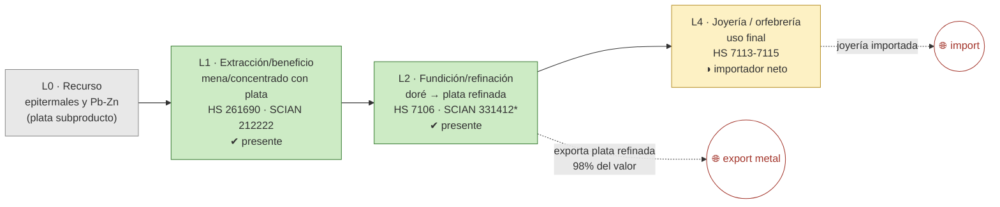

# Ficha de cadena de valor — Plata

> [!abstract] Síntesis
> **Tipo B — truncada en el metal refinado.** México es **1.º productor mundial de plata**. Se extrae (L1) y se refina en el país (L2, Met-Mex Peñoles), y **se exporta ya refinada** (98 % del valor exportado es procesado). Pero la cadena no llega al producto final: la **joyería/orfebrería (L4) es importadora neta**. La plata es en buena parte **subproducto** de las minas de plomo-zinc y de vetas epitermales. Punto de ruptura: **L2→L4**.

> [!info]- ¿Cómo leer esta ficha? (clic para desplegar)
> Cinco **eslabones**: **L0** recurso · **L1** extracción (mina→concentrado, **E1**) · **L2** refinación (→metal, **E2**) · **L3** semimanufactura (**E3**) · **L4** uso final (**E4**). Marcas **✔/◑/✘**. El **punto de ruptura** es donde el país deja de agregar valor; define el **tipo A/B/C/D** y refleja el **enclave estructural**. *En metales preciosos el salto es del metal refinado (L2) al uso (joyería, L4).*

## 1. Árbol de la cadena (L0→L4)

*Verde = existe; amarillo = parcial/importador; flechas rojas = fugas.*

*(\*331412 mezcla oro y plata; su VBP no se separa por metal.)*

**Lectura del diagrama.** Como el oro, la plata **se exporta ya refinada** (agrega el valor del metal), pero la manufactura de joyería y platería se importa. Siendo México el mayor productor mundial, la cadena se cierra en el lingote y no en el producto de consumo.

## 2. Cuantificación por eslabón

> [!note]- ¿Qué significan estas columnas? (clic)
> **VBP/empleo** de la MIP (mmp, base 2018); **X/M** = export/import (MUSD, prom. 2018–2023). El "*" en L2 marca clase compartida oro+plata (≈179 mmp combinados).

| Eslabón | Existe | VBP 2018 (mmp) | Empleo 2018 | X (MUSD) | M (MUSD) | Lectura en una línea |
|---|---|---:|---:|---:|---:|---|
| **L1** extracción | ✔ | 49.8 | 7 598 | 75 | 0 | 1.º productor mundial |
| **L2** refinación\* | ✔ | 179.0\* | 4 622\* | 2 203 | 106 | exporta plata refinada |
| **L4** joyería | ◑ | n/a | n/a | — | — | importador neto |

\* Cifra combinada oro + plata (SCIAN 331412). Fuente: [[cv_eslabones_cuantificado]] · [[peso_bloque_mineria]].

**Captura de valor (CCV):** *no aplica* del modo habitual — la plata casi no se exporta como mena (E1), sino ya refinada; su CCV≈0.01 refleja esa vía, no una baja captura. ([[Memoria - CCV (coeficiente de captura de valor, serie 1992-2025)|CCV]])

## 3. Actores por eslabón

| Eslabón | Actor | Rol | Ubicación | Propiedad |
|---|---|---|---|---|
| L1 | Fresnillo plc, Peñoles, Grupo México, First Majestic… | Extracción (primaria y subproducto) | Zacatecas, Durango… | mixta |
| L2 | **Met-Mex Peñoles** | Refinería de oro y plata | Torreón, Coah. | nacional |

**Lectura.** La refinación se concentra en **Peñoles (Torreón)**, capital nacional; la extracción está repartida entre grandes mineras (varias con cotización en Londres). Fuente: [[empresas_transformacion]] · [[Plata]] (Cap. IV).

## 4. Encadenamientos y demanda intermedia (MIP)

- **A quién le vende dentro del país (2018):** **99 %** a *Fundición y refinación de metales preciosos* (331412).
- **Arrastre (Rasmussen 2018):** hacia atrás 0.99, hacia adelante 1.17 (rank 288/834). Moderado; se agota en la refinación. Fuente: [[mip_encadenamientos_minerales]].

## 5. Cierre aguas abajo

- **Espejo:** `X_share_procesado` ≈ 0.95–0.98: se exporta metal, no mena; la joyería es importadora neta. ([[comercio_posicion_resumen]])
- **Eslabón faltante:** L4 (joyería/platería).

## 6. Georreferenciación

- **HHI geográfico:** 3 022; líder Zacatecas 50 %.
- **Co-localización L1–L2: no** — extracción en el centro-norte (Zacatecas/Durango), refinación en Torreón. ([[georref_regionalizacion]])

## 6b. Mapa de la cadena y socios comerciales

*Izquierda: extracción por estado y plantas de transformación con su empresa. Derecha: a qué países se exporta (rojo) y de cuáles se importa (azul). Comtrade 2019-2024.*

![[mapa_plata.png]]

**Ubicación de los eslabones (empresa · sitio):** refinación en **Torreón, Coahuila** (Met-Mex Peñoles); extracción en Zacatecas, Durango, Chihuahua… Detalle en §3.

**Socios comerciales (2019-2024):**

| Flujo | Principales socios |
|---|---|
| Exporta a | **Estados Unidos 95 %** · Corea del Sur 2 % · Alemania 1 % |
| Importa de | Estados Unidos 88 % · Canadá 4 % · Japón 3 % |

**Lectura.** Siendo el primer productor mundial, México envía **casi toda su plata refinada a Estados Unidos**; la joyería y platería que consume también se importan de EE.UU. La manufactura de valor ocurre fuera, en un eje bilateral con el norte.

## 7. Clasificación tipológica

> [!note] Tipo **B — truncada en el metal refinado**
> | Criterio | Evidencia | → |
> |---|---|---|
> | (i) Actores | L1 disperso + L2 (Peñoles); L4 sin producción | L1–L2 presentes |
> | (ii) Espejo | exporta plata refinada; joyería importada | ruptura L2→L4 |
> | (iii) Ghosh/DI | 99 % a refinación | se agota en el lingote |
>
> **Asignación: B.** Primer productor mundial cuya cadena se cierra en el metal refinado, no en la manufactura. (Tipos: **A** desarrollada · **B** truncada · **C** usuario con insumo importado · **D** exportación en bruto.)

## Fuentes / archivos
`processed/cv_arbol_mineral.csv` · `processed/cv_eslabones_cuantificado.csv` · [[peso_bloque_mineria]] · [[mip_encadenamientos_minerales]] · [[comercio_posicion_resumen]] · [[georref_regionalizacion]] · [[empresas_transformacion]]

← [[Indice - Fichas de Cadena de Valor]] · [[Ruta metodologica - Construccion de cadenas de valor locales por mineral]] · [[Plata]]
