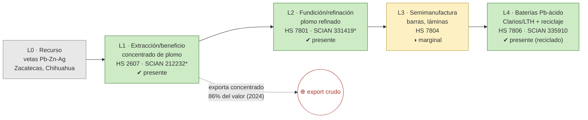

# Ficha de cadena de valor — Plomo

> [!abstract] Síntesis
> **Tipo B — truncada en el metal.** El plomo se coextrae con el zinc (y con plata). Tiene extracción (L1), refinación (L2, Met-Mex Peñoles en Torreón) y un eslabón final singular: **baterías plomo-ácido (L4, Clarios/LTH) con reciclaje**. Aun así, **el grueso se exporta como concentrado** (86 % del valor exportado es crudo en 2024) y las semimanufacturas (L3) son marginales. El circuito de baterías se abastece sobre todo de **plomo reciclado**, no del primario. Punto de ruptura: **L1→L2** (mucho concentrado exportado) y débil L3. 

> [!info]- ¿Cómo leer esta ficha? (clic para desplegar)
> Cinco **eslabones**: **L0** recurso · **L1** extracción (mina→concentrado, **E1**) · **L2** fundición/refinación (→metal, **E2**) · **L3** semimanufactura (**E3**) · **L4** uso final (**E4**). Marcas **✔/◑/✘**. El **punto de ruptura** es donde el país deja de agregar valor; define el **tipo A/B/C/D** (huella del **enclave estructural**). *Plomo y zinc comparten yacimiento y estadística minera (coextracción INEGI); se separan sólo en el comercio.*

## 1. Árbol de la cadena (L0→L4)

*Verde = existe; amarillo = parcial/débil; flechas rojas = fugas.*

*(\*212232 y 331419 son clases compartidas: minería plomo-zinc, y fundición de "otros no ferrosos".)*

**Lectura del diagrama.** Existe refinación (Peñoles) e incluso un uso final fuerte (**baterías**, con un circuito de reciclaje de clase mundial). Pero la cadena del plomo **primario** se rompe pronto: se exporta mucho concentrado y las semis casi no existen; las baterías se nutren del plomo **reciclado**, no del que sale de la mina.

## 2. Cuantificación por eslabón

> [!note]- ¿Qué significan estas columnas? (clic)
> **VBP/empleo** de la MIP (mmp, base 2018); **X/M** = export/import (MUSD, prom. 2018–2023). El "*" marca clases compartidas: L1 (plomo+zinc combinados, ≈35 mmp) y L2 (fundición de otros no ferrosos, ≈14 mmp).

| Eslabón | Existe | VBP 2018 (mmp) | Empleo 2018 | X (MUSD) | M (MUSD) | Lectura en una línea |
|---|---|---:|---:|---:|---:|---|
| **L1** extracción | ✔ | 34.7\* | 11 667\* | 901 | 24 | exporta concentrado |
| **L2** refinación | ✔ | 14.4\* | 1 534\* | 176 | 31 | Peñoles refina |
| **L3** semis | ◑ | n/a | n/a | 0.3 | 0.6 | marginal |
| **L4** baterías | ✔ | n/a | n/a | 1.3 | 8.1 | Clarios/LTH (reciclaje) |

\* L1 y L2 en clase compartida (ver nota). Fuente: [[cv_eslabones_cuantificado]] · [[peso_bloque_mineria]].

**Captura de valor (CCV):** 1.7 (2023) · 2.5 (2024) · 2.7 (2025). El CCV **supera 1**, pero es un **artefacto**: el concentrado de plomo lleva **plata y oro asociados** que elevan su valor por tonelada por encima del precio del plomo puro. No debe leerse como "captura alta". ([[Memoria - CCV (coeficiente de captura de valor, serie 1992-2025)|CCV]])

## 3. Actores por eslabón

| Eslabón | Actor | Rol | Ubicación | Propiedad |
|---|---|---|---|---|
| L2 | **Met-Mex Peñoles** | Refinería de plomo, zinc, plata y oro | Torreón, Coah. | nacional |
| L4 | **Clarios** (marca LTH) | Baterías Pb-ácido + reciclaje (~184 mil t Pb/año recuperado) | Nuevo León | extranjera (marca nacional LTH) |

**Lectura.** La refinación primaria es de Peñoles (nacional). El eslabón de baterías existe y recicla mucho plomo, pero pertenece a Clarios (capital extranjero) y opera en gran medida sobre **chatarra**, no sobre el plomo minero. Fuente: [[empresas_transformacion]] · [[Plomo]] (Cap. IV).

## 4. Encadenamientos y demanda intermedia (MIP)

- **A quién le vende dentro del país (2018, plomo-zinc):** **79.5 %** a *Fundición y refinación de otros metales no ferrosos* (331419) y **5.2 %** a *Fabricación de acumuladores y pilas* (baterías).
- **Arrastre (Rasmussen 2018, plomo-zinc):** hacia atrás 0.99, hacia adelante **0.71** (rank 527/834) — de los **más bajos** del bloque: el plomo-zinc jala poco aguas adelante. Fuente: [[mip_encadenamientos_minerales]].

## 5. Cierre aguas abajo

- **Espejo:** `X_share_crudo` 0.78 (2018) → **0.86 (2024)**: se exporta concentrado. ([[comercio_posicion_resumen]])
- **Circuito de reciclaje:** el eslabón de baterías está domésticamente presente pero desacoplado del plomo primario (usa reciclado).

## 6. Georreferenciación

- **HHI geográfico:** 5 318; líder Zacatecas 71 %.
- **Co-localización L1–L2: no** — extracción en Zacatecas, refinación en Coahuila/SLP. ([[georref_regionalizacion]])

## 6b. Mapa de la cadena y socios comerciales

*Izquierda: extracción por estado y plantas de transformación con su empresa. Derecha: a qué países se exporta (rojo) y de cuáles se importa (azul). Comtrade 2019-2024.*

![[mapa_plomo.png]]

**Ubicación de los eslabones (empresa · sitio):** refinación en **Torreón, Coahuila** (Met-Mex Peñoles); baterías/reciclaje en **Nuevo León** (Clarios/LTH); extracción en Zacatecas, Chihuahua. Detalle en §3.

**Socios comerciales (2019-2024):**

| Flujo | Principales socios |
|---|---|
| Exporta a | **China 57 %** · Corea del Sur 24 % · Estados Unidos 10 % |
| Importa de | Estados Unidos 100 % |

**Lectura.** El **concentrado de plomo se exporta a Asia** (China y Corea), donde se refina; lo poco que se importa (plomo/insumos) viene de Estados Unidos. El circuito de baterías nacional opera aparte, sobre plomo reciclado.

## 7. Clasificación tipológica

> [!note] Tipo **B — truncada en el metal**
> | Criterio | Evidencia | → |
> |---|---|---|
> | (i) Actores | L1, L2 (Peñoles), L4 baterías; L3 marginal | presentes pero desacoplados |
> | (ii) Espejo | crudo 78 %→86 % | ruptura L1→L2 |
> | (iii) Ghosh/DI | forward 0.71 (muy bajo) | poco arrastre aguas adelante |
>
> **Asignación: B.** Hay refinación y hasta baterías, pero el plomo primario sale como concentrado y las semis no existen; el uso final se abastece de reciclado. (Tipos: **A** desarrollada · **B** truncada · **C** usuario con insumo importado · **D** exportación en bruto.)

## Fuentes / archivos
`processed/cv_arbol_mineral.csv` · `processed/cv_eslabones_cuantificado.csv` · [[peso_bloque_mineria]] · [[mip_encadenamientos_minerales]] · [[comercio_posicion_resumen]] · [[georref_regionalizacion]] · [[empresas_transformacion]]

← [[Indice - Fichas de Cadena de Valor]] · [[Ruta metodologica - Construccion de cadenas de valor locales por mineral]] · [[Plomo]]
