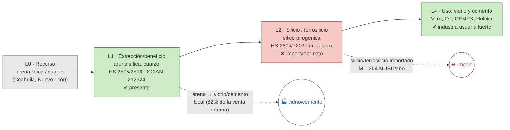

# Ficha de cadena de valor — Sílice

> [!abstract] Síntesis
> **Tipo C — usuario doméstico con eslabón importado.** México extrae arena sílica/cuarzo (L1) y tiene **industria usuaria fuerte** (vidrio: Vitro, Owens-Illinois; y cemento/cerámica), pero el eslabón de **mayor valor —silicio metálico, ferrosilicio, sílice pirogénica— se importa** (importador neto muy marcado, M ≈ 264 MUSD/año contra X ≈ 8). El valor local se genera en el **vidrio y el cemento**, no en la química del silicio. Punto de ruptura: **L1→L2**.

> [!info]- ¿Cómo leer esta ficha? (clic para desplegar)
> Cinco **eslabones**: **L0** recurso · **L1** extracción (arena/cuarzo) · **L2** silicio/ferrosilicio (química) · **L3/L4** usos (vidrio, cemento, electrónica). Marcas **✔/◑/✘**. En el **tipo C** existe el **usuario** (vidrio, cemento) pero el eslabón intermedio de silicio se importa: la demanda está, la transformación química no.

## 1. Árbol de la cadena (L0→L4)

*Verde = existe; rojo = ausente/importado; azul = uso doméstico; flechas rojas = fugas.*

**Lectura del diagrama.** La arena se usa **localmente** para hacer vidrio y cemento (industrias grandes y nacionales), lo cual es una cadena real de bajo grado. Pero el eslabón **químico de alto valor** (silicio metálico y ferrosilicio, base de la electrónica y las aleaciones) **no existe en México y se importa** en grandes cantidades.

## 2. Cuantificación por eslabón

> [!note]- ¿Qué significan estas columnas? (clic)
> **VBP/empleo** de la MIP (mmp, base 2018); **X/M** = export/import (MUSD, prom. 2018–2023). "n/a" = eslabón sin clase estadística propia (se mide con comercio).

| Eslabón | Existe | VBP 2018 (mmp) | Empleo 2018 | X (MUSD) | M (MUSD) | Lectura en una línea |
|---|---|---:|---:|---:|---:|---|
| **L1** extracción | ✔ | 7.0 | 5 642 | 2 | 74 | arena para vidrio/cemento |
| **L2** silicio/ferrosilicio | ✘ | n/a | n/a | 8 | 264 | **importador neto fuerte** |
| **L4** uso (vidrio/cemento) | ✔ | — | — | — | — | Vitro, O-I, CEMEX |

Fuente: [[cv_eslabones_cuantificado]].

**Captura de valor (CCV):** 0.16–0.21. Se exporta poca arena y a bajo valor; el problema no es la exportación sino la **ausencia del eslabón de silicio** frente a una industria del vidrio grande. ([[Memoria - CCV (coeficiente de captura de valor, serie 1992-2025)|CCV]])

## 3. Actores por eslabón

| Eslabón | Actor | Rol | Ubicación | Propiedad |
|---|---|---|---|---|
| L4 (uso) | **Vitro; Owens-Illinois de México** | Vidrio (funden arena sílica); O-I también extrae arena | Monterrey / varias | nacional/extranjera |
| L4 (uso) | **CEMEX; Holcim México; GCC** | Cemento y cerámica | varias | nacional/extranjera |
| L2 | (mayormente importado) | Silicio metálico / ferrosilicio | — | — |

**Lectura.** Los actores presentes son **usuarios** (vidrio, cemento). El silicio metálico —el eslabón que daría valor tecnológico— se importa. Fuente: [[empresas_transformacion]] · [[Silice]] (Cap. IV).

## 4. Encadenamientos y demanda intermedia (MIP)

- **A quién le vende dentro del país (2018):** **43 %** a *Envases de vidrio*, **39 %** a *Cemento* y el resto a otros no metálicos/cerámica → uso doméstico concentrado en vidrio y cemento.
- **Arrastre (Rasmussen 2018):** hacia atrás 0.94, hacia adelante **1.92** (rank **18/834**, el **más alto** del bloque): la sílice alimenta muchas industrias, pero el eslabón de silicio de alto valor está fuera. Fuente: [[mip_encadenamientos_minerales]].

## 5. Cierre aguas abajo

- **Espejo:** importador neto muy marcado del procesado (`M_share_procesado` ≈ 0.77–0.82); exporta arena, importa silicio/ferrosilicio. ([[comercio_posicion_resumen]])
- **Eslabón faltante:** L2 (silicio metálico, ferrosilicio, sílice de alta pureza para electrónica/solar).

## 6. Georreferenciación

- **HHI geográfico:** 4 258; líder Coahuila 52 %.
- **Co-localización L1–usuario: parcial** — arena en Coahuila; vidrio en Monterrey (Nuevo León). ([[georref_regionalizacion]])

## 6b. Mapa de la cadena y socios comerciales

*Izquierda: extracción por estado y usuarios (vidrio/cemento). Derecha: a qué países se exporta (rojo) y de cuáles se importa (azul). Comtrade 2019-2024.*

![[mapa_silice.png]]

**Ubicación de los eslabones (empresa · sitio):** arena en **Coahuila y Nuevo León**; vidrio en **Monterrey** (Vitro, Owens-Illinois); cemento/cerámica en varias plantas (CEMEX, Holcim, GCC). Detalle en §3.

**Socios comerciales (2019-2024):**

| Flujo | Principales socios |
|---|---|
| Exporta a | Estados Unidos 92 % · Guatemala 7 % · Colombia 0 % |
| Importa de | Estados Unidos 49 % · **China 37 %** · Canadá 3 % |

**Lectura.** La arena apenas se exporta (a EE.UU. y Centroamérica); lo relevante es la **importación de silicio/ferrosilicio desde Estados Unidos y China**, el eslabón de alto valor ausente. La industria del vidrio existe, pero la química del silicio se compra afuera.

## 7. Clasificación tipológica

> [!note] Tipo **C — usuario doméstico con eslabón importado**
> | Criterio | Evidencia | → |
> |---|---|---|
> | (i) Actores | usuarios (vidrio, cemento) presentes; sin productor de silicio | eslabón químico ausente |
> | (ii) Espejo | importador neto de silicio/ferrosilicio | ruptura L1→L2 |
> | (iii) Ghosh/DI | forward 1.92 (el más alto); vidrio+cemento | demanda amplia, sin química local |
>
> **Asignación: C.** Cadena de bajo grado local (arena→vidrio/cemento) real, pero el eslabón de silicio de alto valor se importa. (Tipos: **A** desarrollada · **B** truncada · **C** usuario con insumo importado · **D** exportación en bruto.)

## Fuentes / archivos
`processed/cv_arbol_mineral.csv` · `processed/cv_eslabones_cuantificado.csv` · [[peso_bloque_mineria]] · [[mip_encadenamientos_minerales]] · [[comercio_posicion_resumen]] · [[georref_regionalizacion]] · [[empresas_transformacion]]

← [[Indice - Fichas de Cadena de Valor]] · [[Ruta metodologica - Construccion de cadenas de valor locales por mineral]] · [[Silice]]
