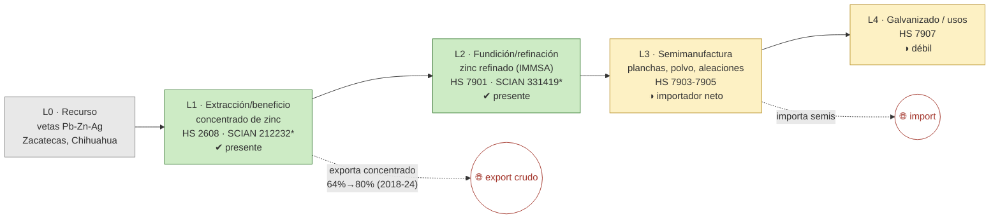

# Ficha de cadena de valor — Zinc

> [!abstract] Síntesis
> **Tipo B — truncada en el metal.** El zinc se coextrae con el plomo. Se extrae (L1), se refina en el país (L2, Grupo México/IMMSA en SLP y Met-Mex Peñoles), pero **se exporta mucho concentrado** (el crudo pasó de 64 % a 80 % del valor exportado, 2018→2024) y las semimanufacturas y el galvanizado (L3–L4) son débiles/importadores. Punto de ruptura: **L1→L2**.

> [!info]- ¿Cómo leer esta ficha? (clic para desplegar)
> Cinco **eslabones**: **L0** recurso · **L1** extracción (mina→concentrado, **E1**) · **L2** fundición/refinación (→metal, **E2**) · **L3** semimanufactura (**E3**) · **L4** uso final (**E4**). Marcas **✔/◑/✘**. El **punto de ruptura** define el **tipo A/B/C/D** (huella del **enclave estructural**). *Plomo y zinc comparten yacimiento y estadística minera; se separan en el comercio.*

## 1. Árbol de la cadena (L0→L4)

*Verde = existe; amarillo = parcial/débil; flechas rojas = fugas.*

*(\*212232 y 331419: clases compartidas plomo-zinc / no ferrosos.)*

**Lectura del diagrama.** Hay refinación de zinc (IMMSA en San Luis Potosí, Peñoles en Torreón), pero, igual que el cobre, **se exporta cada vez más concentrado** y las semis (planchas, polvo) y el galvanizado se importan. La cadena se cierra en el metal, no en el producto.

## 2. Cuantificación por eslabón

> [!note]- ¿Qué significan estas columnas? (clic)
> **VBP/empleo** de la MIP (mmp, base 2018); **X/M** = export/import (MUSD, prom. 2018–2023). El "*" marca clases compartidas: L1 (plomo+zinc, ≈35 mmp) y L2 (no ferrosos, ≈14 mmp).

| Eslabón | Existe | VBP 2018 (mmp) | Empleo 2018 | X (MUSD) | M (MUSD) | Lectura en una línea |
|---|---|---:|---:|---:|---:|---|
| **L1** extracción | ✔ | 34.7\* | 11 667\* | 498 | 24 | exporta concentrado |
| **L2** refinación | ✔ | 14.4\* | 1 534\* | 352 | 74 | IMMSA/Peñoles refinan |
| **L3** semis | ◑ | n/a | n/a | 1.4 | 48 | **importador neto** |
| **L4** galvanizado | ◑ | n/a | n/a | 8.8 | 74 | débil |

\* L1 y L2 en clase compartida. Fuente: [[cv_eslabones_cuantificado]] · [[peso_bloque_mineria]].

**Captura de valor (CCV):** 0.38 (2023) · 0.36 (2024) · 0.40 (2025): al exportar concentrado, México capta ~36–40 % del precio del zinc refinado. ([[Memoria - CCV (coeficiente de captura de valor, serie 1992-2025)|CCV]])

## 3. Actores por eslabón

| Eslabón | Actor | Rol | Ubicación | Propiedad |
|---|---|---|---|---|
| L2 | **Grupo México (IMMSA)** | Refinería de zinc | San Luis Potosí | nacional |
| L2 | **Met-Mex Peñoles** | Refinería de plomo, zinc, plata y oro | Torreón, Coah. | nacional |

**Lectura.** Dos refinerías de zinc de capital nacional (IMMSA y Peñoles). Aun así, el concentrado excede lo que refinan y se exporta; las semis se importan. Fuente: [[empresas_transformacion]] · [[Zinc]] (Cap. IV).

## 4. Encadenamientos y demanda intermedia (MIP)

- **A quién le vende (2018, plomo-zinc):** 79.5 % a *Fundición y refinación de otros metales no ferrosos* (331419); resto baterías y otros.
- **Arrastre (Rasmussen 2018):** hacia atrás 0.99, hacia adelante **0.71** (rank 527/834), de los más bajos. Fuente: [[mip_encadenamientos_minerales]].

## 5. Cierre aguas abajo

- **Espejo:** `X_share_crudo` 0.64 (2018) → **0.80 (2024)**; semis y galvanizado importadores netos. ([[comercio_posicion_resumen]])
- **Eslabón faltante:** L3–L4 (semis y galvanizado), mercado que abastece la industria del acero recubierto.

## 6. Georreferenciación

- **HHI geográfico:** 3 436; líder Zacatecas 56 %.
- **Co-localización L1–L2: no** — extracción en Zacatecas, refinación en SLP/Coahuila. ([[georref_regionalizacion]])

## 6b. Mapa de la cadena y socios comerciales

*Izquierda: extracción por estado y plantas de transformación con su empresa. Derecha: a qué países se exporta (rojo) y de cuáles se importa (azul). Comtrade 2019-2024.*

![[mapa_zinc.png]]

**Ubicación de los eslabones (empresa · sitio):** refinación de zinc en **San Luis Potosí** (Grupo México/IMMSA) y **Torreón, Coahuila** (Met-Mex Peñoles); extracción en Zacatecas, Chihuahua. Detalle en §3.

**Socios comerciales (2019-2024):**

| Flujo | Principales socios |
|---|---|
| Exporta a | **Corea del Sur 40 %** · Estados Unidos 25 % · Japón 8 % |
| Importa de | Estados Unidos 51 % · Canadá 14 % · Perú 14 % |

**Lectura.** El **concentrado de zinc se dirige a Asia** (Corea, Japón) para su refinación; las semis y el metal que faltan se importan de Estados Unidos y otros. El grueso del valor añadido ocurre fuera.

## 7. Clasificación tipológica

> [!note] Tipo **B — truncada en el metal**
> | Criterio | Evidencia | → |
> |---|---|---|
> | (i) Actores | L1, L2 (IMMSA, Peñoles); L3–L4 débiles | L1–L2 presentes |
> | (ii) Espejo | crudo 64 %→80 %; semis importador neto | ruptura L1→L2 |
> | (iii) Ghosh/DI | forward 0.71 (bajo) | poco arrastre |
>
> **Asignación: B.** Refinación nacional presente, pero exporta concentrado e importa semis/galvanizado. (Tipos: **A** desarrollada · **B** truncada · **C** usuario con insumo importado · **D** exportación en bruto.)

## Fuentes / archivos
`processed/cv_arbol_mineral.csv` · `processed/cv_eslabones_cuantificado.csv` · [[peso_bloque_mineria]] · [[mip_encadenamientos_minerales]] · [[comercio_posicion_resumen]] · [[georref_regionalizacion]] · [[empresas_transformacion]]

← [[Indice - Fichas de Cadena de Valor]] · [[Ruta metodologica - Construccion de cadenas de valor locales por mineral]] · [[Zinc]]
