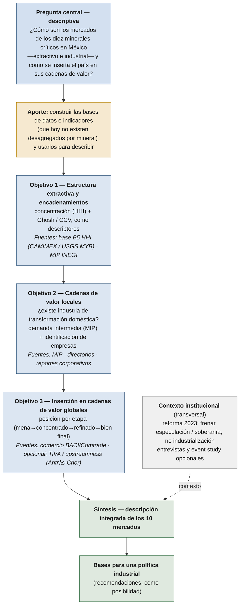

# Diagrama — columna vertebral metodológica (diseño descriptivo)

Algoritmo **descriptivo** de la investigación: caracterizar los mercados de los diez minerales críticos y sus cadenas de valor (local y global) para sentar las bases de una política industrial. Descripción paso a paso en [[Columna Vertebral Metodologica]]. Versión imprimible: ![[Columna Vertebral Metodologica - Diagrama.pdf]]

## Cómo leerlo

- **No hay causalidad ni "puente que decide la causa".** El hilo es **descriptivo**: tres objetivos que caracterizan cada mercado (estructura extractiva → cadena local → posición global) y convergen en una síntesis.
- **Objetivo 1** retrata el lado extractivo (concentración y encadenamiento); **Objetivo 2**, si hay industria compradora doméstica; **Objetivo 3**, en qué eslabón de la cadena global participa México.
- La **síntesis** integra los tres retratos y sienta las **bases de política industrial**.
- El **marco institucional** (reforma 2023) es contexto transversal, no una palanca de industrialización.

## Fuentes por paso

| Paso | Insumo / fuente |
|---|---|
| Obj. 1 — estructura + encadenamientos | Base B5 HHI (CAMIMEX + USGS MYB Tabla 2); MIP INEGI (Leontief/Ghosh/CCV) |
| Obj. 2 — cadenas de valor locales | MIP (demanda intermedia doméstica) + directorios y reportes de empresas |
| Obj. 3 — inserción en CVG | Comercio BACI/Comtrade por etapa; opcional: OECD TiVA / upstreamness |
| Síntesis + política | Integración descriptiva de los 10 mercados |
| Contexto institucional | Reforma 2023 (documental); entrevistas / event study opcionales |

← [[Home]] · [[Columna Vertebral Metodologica]] · [[Diseno Metodologico|Diseño Metodológico]]
